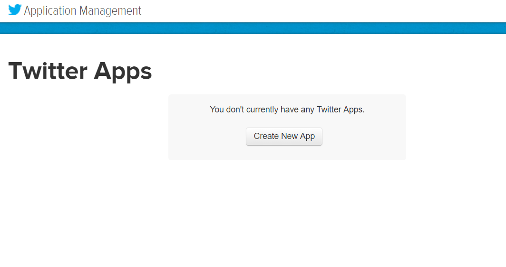
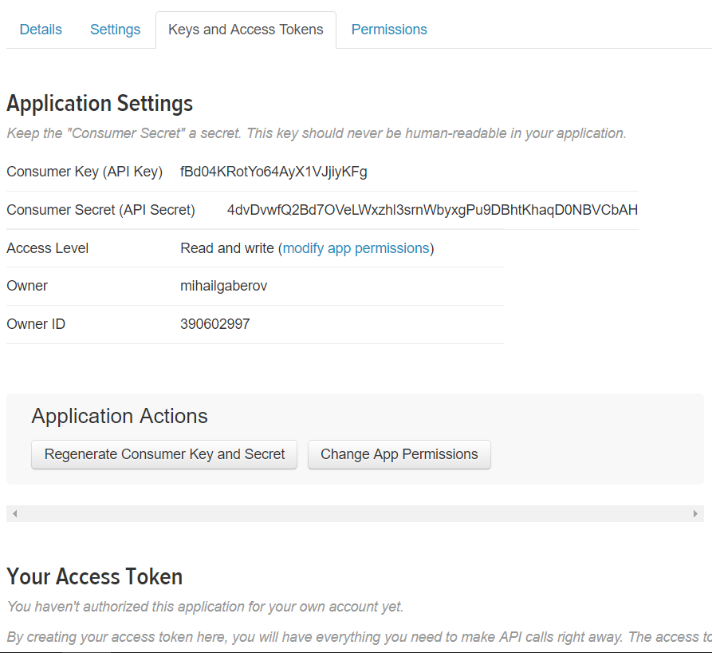
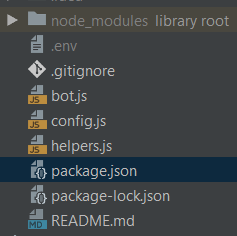
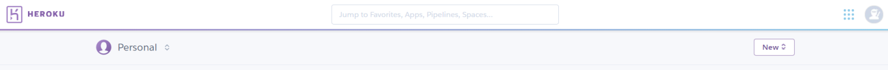
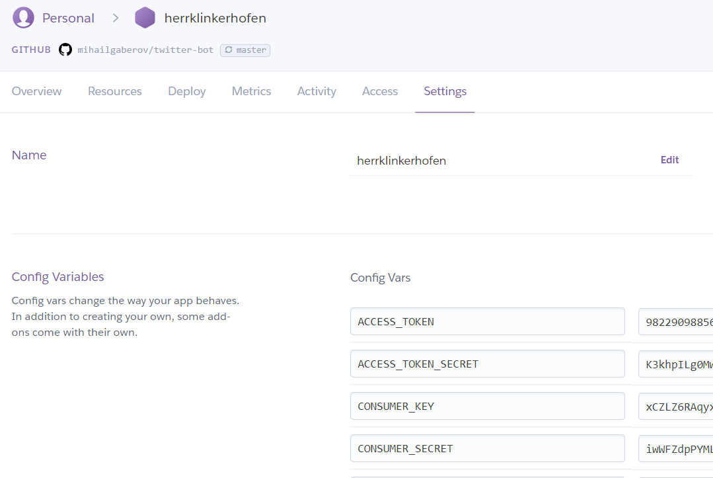
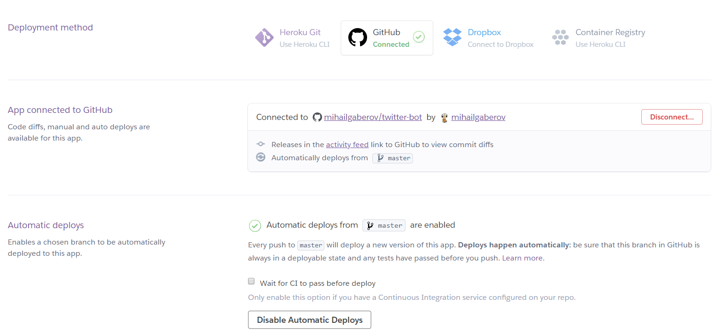
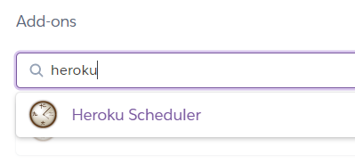
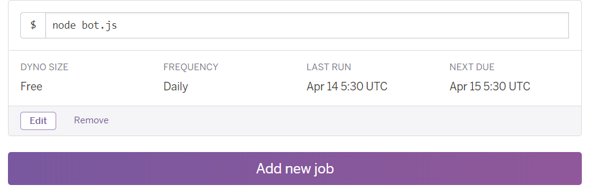

###### Photo by freestocks.org on Unsplash

Nowadays the use of social networks is considered a normal thing, something that is part of our daily life. Maybe most of the people even don’t think about it. They just use them automatically. Just like that.

But some of these people may also ask the question which made me write this article — what do we get from these networks for giving them our personal data, our interests and preferences? What can we use them for?

Well, creating a Twitter bot is not new nor hot topic (not even hard to do), but it’s one of those things I am alluding about. Twitter is a social network that generates and uses enormous data flows from people to people. And the so called bots in this network are actually small programs written in a certain programming language.

_One of the most valuable thing we can get from the social networks is the data. And we can do that in an automated way. Here is where these pieces of software, the bots, can help us._

If you google the topic, you will see that one of the most common examples for a Twitter bot is the one that retweets or likes certain tweets, searched by certain criteria. That criteria can be defined by the creator of the bot. The more I was reading on the topic, the more I was thinking about what can I do with such bot. Also I had to make sure that this is not going to spam and annoy other people. Again, the simplest answer is the right one. __I have decided to create a bot that will send me private messages with information about tweets related to topics I am interested in.__ Very shortly after I did the first version (started around 5 in the morning, hence the title of the article :)) I thought myself that I have to do it a bit more useful for the other people as well.

This is how I ended up creating a Twitter bot with Node.js that sends direct messages to his followers with information about tweets relevant to certain search criteria.

Enough talking for now, let’s begin the fun part.

__TL;DR__

The rest of the article will be a step by step tutorial of how to create a twitter bot and deploy it to [Heroku](https://www.heroku.com "Heroku's Homepage"). The bot will be sending private messages to his followers. The messages will contain tweets related to predefined search criteria. You may already be familiar with the term #hashtag. Practically such hashtags are going to be our search criteria or the words by which we will filter the tweets. In my case I have selected to use the following: #js, #javascript, #JavaScript, #JS, #Javascript, #react, #reactjs, #nodejs, #Nodejs. Which means that the bot will send messages with tweets mentioning them. Then we will fetch the IDs of all the followers that the bot has and use them to send direct messages back to them.

If you want to skip right to the code, here is the [GitHub repo](https://github.com/mihailgaberov/twitter-bot "Twitter bot GitHub repo").

Initial setup
Setup the project via ___npm___:

Since this is going to be Node.js based project, it makes sense to use the famous node package manager [NPM](https://www.npmjs.com/). First, make sure you have [Node.js](https://nodejs.org/en/) installed and then you can use _npm_.

After you are done with the installations you can setup a simple project for our bot. In order to start, type the following in your terminal:

1. ___npm init___
2. Answer the questions that npm asks you to create your package.json file (you can skip this and use the defaults answers by adding __-y__ parameter like so: ___npm init -y___)
3. Install the dependencies we need by typing: ___npm i twit dotenv --save-dev___. This will install all the packages we need to create our bot. (‘i’ is short for ‘install’)

_Note about packages_: both packages are famous in what they do. The first one, [dotenv](https://www.npmjs.com/package/dotenv), is for handling the [environment variables](https://en.wikipedia.org/wiki/Environment_variable) via .env file. This is where we will store our API keys and tokens. The second one, [twit](https://www.npmjs.com/package/twit), is a Twitter API client for Node.js, which is providing a nice and easy to use interface for interacting with Twitter API.

__Configuration settings__

In order to be able to consume the [Twitter API](https://developer.twitter.com/en/docs), we need to obtain four things: consumer key, consumer secret, access token and access token secret. These are simple strings as you will see in a moment. The only thing you need to do, to get these, is a Twitter account. Once you got it, go to https://apps.twitter.com/ and create new app.



Then you have to go to “Keys and Access Tokens” tab and generate your tokens by clicking the button on the bottom.



Now once you have these configurations we are ready to continue. Go back to your project and create a new file. You can name it _config.js_. Put the following code in it:
```javascript
require('dotenv').config()
module.exports = {
 consumer_key: process.env.CONSUMER_KEY,
 consumer_secret: process.env.CONSUMER_SECRET,
 access_token: process.env.ACCESS_TOKEN,
 access_token_secret: process.env.ACCESS_TOKEN_SECRET
}
```

This is just a simple object containing the configurations we need. By using [Node.js module exporting](https://nodejs.org/api/modules.html) we are exposing it for later use.

Then create another file in the main project directory and name it [.env](https://www.twilio.com/blog/2017/08/working-with-environment-variables-in-node-js.html) — this is where we will put our previously generated keys. Here is how it should look like:

```javascript
CONSUMER_KEY=jsjIiJsjNslaxxxxxxxxxx
CONSUMER_SECRET=ksjdhdjdxxxxxxxx
ACCESS_TOKEN=jdjwowlgxxxxxxxxxxxx
ACCESS_TOKEN_SECRET=jsoJdPxxxxx
```

Of course, the values of the keys are your personal secret keys and that is why you __must not__ commit this file to a public repository.

__Interacting with Twitter API__

Once we are done with the configurations we can start implementing the main logic of our bot. We will put that logic in a new file — _bot.js_ (of course you can name yours as you wish).

Start by requiring (e.g. importing) the dependencies we have:
```javascript
const Twit = require('twit')
const config = require('./config')
const helpers = require('./helpers')
```
The first one is the package we installed to help us manipulating easily Twitter APIs. The second one is our configurations and the last one is a small helper file which will contain some useful functions we can reuse. I will explain this more in detail a bit later.

As a side note I must mention that the Node.js version I am using is the last stable one. If you don’t want to explicitly update yours, I would suggest to try this tutorial with your current one — if it’s working, don’t bother.

This is how eventually your project structure will look like by now:



The next step is to initialize the Twit client by passing our config as an input argument:
```javascript
const Twitter = new Twit(config)
```
Right after this, is where the implementation of our main function goes. It implements all the logic we need to fetch tweets, filter them as per our search criteria and send direct messages to the followers of our bot.

__Searching__

We start with the searching functionality by using the _get()_ method from twit package for sending a GET request to _search/tweets_ end point. We also pass a params object, containing our search preferences, such as the hashtags we talked about and also some other filters.
```javascript
const sendDirectMessage = function ()
const params = {
  q: '#js, #javascript, #JavaScript, #JS, #Javascript, #react,' +
'#reactjs, #nodejs, #Nodejs, -filter:retweets',
  result_type: 'recent',
  lang: 'en'
}
Twitter.get('search/tweets', params, function (err, data) {…}
```
__Filtering the response__

Pay attention to the last part of the ‘q’ property. This is a filter provided by [Twitter API](https://developer.twitter.com/en/docs/tweets/search/api-reference/get-search-tweets.html) that allows us to filter the results we will get and make sure we don’t receive any retweets. This help us to reduce the duplicates in the bot’s report messages.

_result_type_ is another flag provided by Twitter, that narrows the results to include only recently published tweets.

__Generate the content__

Next step is to generate the content of the messages the bot will be sending to his followers. This is done by simply iterating _data.statuses_ array which contains all the tweets returned by the search request we did. Then I am using [ES6 string templates](http://es6-features.org/#StringInterpolation) to compose the _content_ object, which in the end is just another, a bit longer, string that will serve as the actual content of the messages.
```javascript
data.statuses.forEach((status) => {
  content += ` — — New Tweet:\n
  Status text: ${status.text} \n
  By: ${status.user.name}\n\n`
})
```
__Get the followers__

Then we need to do another request, in order to get the IDs of all followers. We will use these IDs when we implement the functionality behind the actual sending. This is done by hitting _‘followers/ids’_ end point and passing the id and the screen name of our bot (only the id is required parameter though).
```javascript
Twitter.get('followers/ids', {
  user_id: 982290988562608129,
  screen_name: 'herrklinkerhof3'
}, function (err, response) {…}
```
__Sending messages__

In the callback part of our request for getting the followers IDs is where the logic for sending direct messages is. We use another loop ([forEach](https://developer.mozilla.org/en-US/docs/Web/JavaScript/Reference/Global_Objects/Array/forEach) JavaScript array’s method) to iterate through the followers IDs and we do a POST request to _‘direct_messages/events/new’_ per each of them, posting the content we composed earlier.
```javascript
response.ids.forEach((id) => {
  Twitter.post('direct_messages/events/new', {
    event: {
      'type': 'message_create',
      'message_create': {
        'target': {
          'recipient_id': id
        },
        'message_data': {
          'text': content,
        }
      }
    }
}, function (err, response) {…}
```
And that’s it. In the bottom of the file we just call our newly created function.

__Error handling__

In this tutorial there is no actual error handling implemented. This would be a topic for another article. Here, for simplicity sake, we just console log the errors.

__Full code__

After you finish all steps, your file should look something like this:
```javascript
const Twit = require('twit')
const config = require('./config')
const helpers = require('./helpers')
const Twitter = new Twit(config)
const sendDirectMessage = function () {
  const params = {
    q: '#js, #javascript, #JavaScript, #JS, #Javascript, #react, ' +
     '#reactjs, #nodejs, #Nodejs, -filter:retweets',
    result_type: 'recent',
    lang: 'en'
  }
  Twitter.get('search/tweets', params, function (err, data) {
    if (!err) {
      let content = `== New report (from ${helpers.getCurrentTime()}          
       (${data.statuses.length} tweets)) ==\n`
      data.statuses.forEach((status) => {
        content += ` — — New Tweet:\n
        Status text: ${status.text} \n
        By: ${status.user.name}\n\n`
      })
      Twitter.get('followers/ids', {
        user_id: 982290988562608129,
        screen_name: 'herrklinkerhof3'
      }, function (err, response) {
           if (err) {
             console.log('Something went wrong while getting' +
              ' followers. Error: ', err)
           }
           if (response) {
             response.ids.forEach((id) => {
               Twitter.post('direct_messages/events/new', {
                 event: {
                   'type': 'message_create',
                   'message_create': {
                     'target': {
                       'recipient_id': id
                     },
                     'message_data': {
                       'text': content,
                     }
                   }
                 }
      }, function (err, response) {
           if (response) {
             console.log('Message sent. Response: ', response)
           }
           if (err) {
             console.log('Something went wrong while sending' +
              ' message. Error: ', err)
           }
         })
       })
      }
    })
     } else {
       console.log('Something went wrong while searching.')
     }
  })
}
sendDirectMessage()
```
__What is the current time__

I mentioned earlier the helpers file (_helpers.js_). At this time it only has one function, but it easily could have as many as you need. The idea behind this is to show you how convenient and easy to work with is when you modularize your code and make it reusable. The function in question is used to get the current time that we include in the header of the reports. Simple as that.

__Running the bot locally__

To run the bot locally the only thing you have to do is open your terminal and type the following:

_npm start_

If everything is good you will see ‘Message sent. Response: …’ message in the console and all the existing followers will receive the generated message.


__Deploying to Heroku__

After we finish the coding, it’s time to deploy our work somewhere. One of the most famous hosting platforms out there is called [Heroku](https://id.heroku.com/login). We are going to use it for hosting our bot application. It gives you options to open a free account and have up to 5 web applications deployed (they will give you more if you verify yourself with a credit card number). After you create your account and login you will see a menu “New” in the top part of the screen, that you can use to create a new application.



You can name your application as you want.


__Config variables__

After you create your new app you should be able to find the “Settings” tab. Go there and click “Reveal Config Vars” button. Here you can enter your configuration variables (you remember — your consumer and API keys).



After you add them, there is just one more thing to do, in order to deploy your app. Go to the “Deploy” tab and connect your GitHub repository to the app. Then enable the automatic deploys and that’s all.



On the bottom of the same page you will find ”Deploy branch” button. Use it to start your first deployment.

With that done you should have your bot deployed to Heroku. If you have enabled the automatic deploys, every time when you commit something to your GitHub repository a new deploy will be triggered.


__Heroku Scheduler__

There is something very useful that we can use in Heroku, when we want to trigger certain tasks at certain period of time. It’s called [Heroku Scheduler](https://devcenter.heroku.com/articles/scheduler), a plug-in that allows you exactly that. You can find it under “Resources” tab.



You will be able to use it for free if you have entered your credit card details. In our case we will use it to run the bot at certain time which means that it will execute the logic for searching and sending messages that we implemented. We do this by adding a job to be run by the scheduler like so:



This way we can have regular reports and be up to date with what the people are tweeting for, regarding our predefined interests. I used that for my implementation and it gets triggered each morning at 5:30 UTC.


__Conclusion__

By now you should have a fully working Twitter bot deployed on Heroku or at least the idea of how to achieve that. What we did, in summary, is that we saw how we can make the social networks work for us by implementing a Twitter bot and making him look for information we are interested in and send us reports as direct messages. Moreover we have added a piece of usefulness not only for us, but for whoever is interested in the same topics by allowing the followers of the bot to get those reports as well. I hope this was an interesting journey for you as much as it was for me. Feel free to send me your questions or critiques, or you can just share your experience.


__To be continued…__

In another article we will see how can we use a database to store the last search results from those tweets and generate reports with only unique new tweets. Stay tuned.


__UPDATE__

_I have reduced the initial number of the hashtags used for searching and used the [OR operator](https://developer.twitter.com/en/docs/tweets/search/guides/standard-operators) for better search results._

_You can find my implementation here https://github.com/mihailgaberov/twitter-bot. If you want to start receiving the same reports as me, follow my bot in Twitter @HerrKlinkerhof3_
