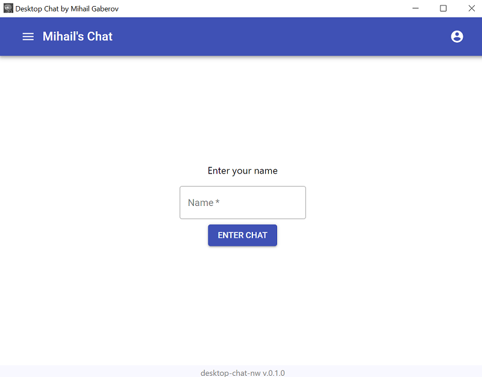

###### Chat Screen
---

This is not your typical "_paste this here_" and "_paste that there_"-type tutorial (you can find plenty of those here on [cometchat.com/tutorials](https://www.cometchat.com/tutorials/desktop-chat-app-tutorial/)). While those tutorials certainly have merit, I am going to share my thought process from beginning to end.

The application I built is simple enough. When someone loads the app, they are prompted to enter their username and begin chatting:



The application ultimately runs on Node with help from NW.js (previously known as node-webkit). NW.js is advantageous because it enables us to code cross-platform desktop applications using our favorite web technologies. For this application, I chose to use React and Redux.

The back-end logic - from sending and receiving messages in real-time to populating what I call the "participant list" - is powered by CometChat. You will learn more about [CometChat](https://cometchat.com/pro) as you read on.

This post is not intended to be a walkthrough. Although I will be explaining the technical components of this application, my main ambition is to help you think through a solution from beginning to end. Hopefully, when you finish this post you'll be a slightly better developer and consider CometChat for your growing tool belt.

## Just want the example code?
You may see the source code [here](https://github.com/mihailgaberov/desktop-chat-nw). There is also a detailed [README](https://github.com/mihailgaberov/desktop-chat-nw/blob/master/README.md), where you will find all the information you need to install, run and test the app.

Because the desktop app is built using web technologies, it is entirely possible to run it in your browser. Towards the end of this post, I will show you how to deploy the app on Netlify.

## Planning
In this section we have to decide what components will we need to build. What functionality will they have? In other words, what are the questions we need to answer, to plan the building process?

Let’s step back for a while and think. Try asking yourself the questions who will take us to the structure we need for our app.

_Below I am going to lay out my questions and the answers. This is the process of the actual building the structure of the app, but in your head first. Keep in mind that it happens very often such that when answering a question new questions appear. This was the case with me as well._

__Questions:__

- What am I doing? 😆
- What kind of app am I going to be building?
- What are the most common components, such an app needs to have?
- How do the app’s components interact with each other?
- What level of completion am I aiming for — (demo apps are not supposed to be fully featured)?


__Answers__ (following the order of the questions):

- This is the most neglected question that many people forget to think about. _When one can step aside first and give a clear answer to this question, his path for future developments becomes settled_. In my specific case the answer I got sounds something like this — “I am thinking about building a chat app. This app should serve as a tutorial demo app. It will have to provide basic functionality for ‘having a chat’ by using CometChat API. It should run on a desktop”. The styling and specific details about what goes where will come later in the process.
- A chat app that will run on desktop and serve as a demo for this tutorial.
- To give a proper answer to this question, a non-familiar person would have to do some research first. Take a look at real-world chat applications. Make notes of what features they have. How are they put them in place, how do they interact between them and with the users of the app. In my case, I had some [previous experience](https://mihail-gaberov.eu/how-i-build-chat-app-with-react-and-typescript-part1/) and got, more or less, the idea of what I need.
- The interaction between the components would be pretty straight forward. The user should be able to use the main component that is a text input and a button to send messages. And a sidebar component to see the other chat participants.
- The demo app should provide basic chat functionality — send and receive real-time messages. And be able to run on a desktop (without a browser).

## Features
I have decided to implement the following features to the demo app:

- Send with Enter key
- A sidebar with names and last active time
- Welcome screen with input and validation with error messages
- Chat area with auto-scroll to bottom
- Chat message and time of sending.

## Front End — React
We are going to use [React](https://reactjs.org/) to build our user interface. Below, I am going to list the components I have created and a short explanation about each of them:

- [ChatPane](https://github.com/mihailgaberov/desktop-chat-nw/tree/master/src/components/ChatPane) — this is the main container-like component that contains the Participants and Conversation components and passes the data they need to visualize.
- [Conversation](https://github.com/mihailgaberov/desktop-chat-nw/blob/master/src/components/Conversation/Conversation.jsx) — this is the component responsible for typing and sending chat messages.
- [Footer](https://github.com/mihailgaberov/desktop-chat-nw/blob/master/src/components/Footer/Footer.jsx) — displays a simple footer message, containing the app name and version, as defined in package.json file.
- [Header](https://github.com/mihailgaberov/desktop-chat-nw/blob/master/src/components/Header/Header.jsx) — header component holding the application menu bar.
- [MenuAppBar](https://github.com/mihailgaberov/desktop-chat-nw/blob/master/src/components/MenuAppBar/MenuAppBar.jsx) — application menu bar component, simulating how a real menu bar would look like. The hamburger menu on the left and the profile dropdown menu on the right are fake — clickable, but not functional.
- [Messages](https://github.com/mihailgaberov/desktop-chat-nw/blob/master/src/components/Messages/Messages.jsx) — a container component, holding a message itself — it has the name of the sender, the message content and the time of sending.
- [Participants](https://github.com/mihailgaberov/desktop-chat-nw/tree/master/src/components/Participants) — this component shows the name of a chat member and the time when he joined.
- [Welcome](https://github.com/mihailgaberov/desktop-chat-nw/tree/master/src/components/Welcome) — this component is responsible for displaying the login page — the starting point of our app, where we have logic related to checking for certain allowed usernames and storing them to the local storage for later use. I also implemented basic error handling logic, which shows an error when the selected username is not correct, as per CometChat API (in this specific case for our demo) registered usernames — superhero1, superhero2 and so on till 5.


Here a visual representation of the app components:


## State Management — Redux
Every modern application these days has a state. Place in the memory where the application is storing certain data for later use. For our application state management, we use [Redux](https://redux.js.org/). Of course, for a simple app like this, we could go without using Redux at all. But, from the learning point of view (_after all we all do this for learning new stuff, right?_), I think it would be nice to see the whole cycle of sending a request to an API, going through a middleware (redux-thunks) and getting the response recorded to the state. And we will manage this state by using Redux.

### How it works
The main building blocks in a Redux app are called reducers — small functions used for managing the state. Simply said, what they do is accepting the old state object as input and, depending on certain actions (which are also passed in the same input), returning new state object. The new state could be changed in full or just partially.

In our app, we have three simple reducers, which are responsible for those parts of the state, responsible for the users’ list, the login process and sending/receiving messages. All of them can be seen in [/src/reducers](https://github.com/mihailgaberov/desktop-chat-nw/tree/master/src/reducers) folder, along with a [file](https://github.com/mihailgaberov/desktop-chat-nw/blob/master/src/reducers/initialState.js) containing the initial state of our app.

Redux, as state management library, can be used with any other UI framework, practically every app that needs to have a state can benefit from using Redux. If you want to go deeper, start from their website and follow along.

## Side Effects Handling — Redux Thunks
One of the best known approaches for managing side effects in a redux app is called [redux-think](https://github.com/reduxjs/redux-thunk). This is what we use in our application as well. If you want to learn more details about redux thunks and how to use them, I recommend their website as a starting point and then build a small application, like this one for example :).

In our project, in [/src/actions folder](https://github.com/mihailgaberov/desktop-chat-nw/tree/master/src/actions), is where I put the thunks used in the demo application. And in [/store](https://github.com/mihailgaberov/desktop-chat-nw/tree/master/src/store) directory is where the configurations for the redux store live.

## Make it desktop — NW.js
The part of our application that makes it possible for our app to run on desktop is taken care of by a library called [NW.js](https://nwjs.io/). Remember that we are building a desktop application. Exactly the desktop part is going to be implemented via NW.js. Similar to [Electron](https://electronjs.org/), another library for building desktop applications, NW.js provides a way to the developers to use their web skills to build applications that can run on a desktop. This means you can still use your JavaScript/React skills when building an app and then leverage the power of the desktop operating system via Nw.js APIs. In other words, Nw.js gives you the ability to make a skeleton app, which can be “filled” with your UI, no matter what library you have used to create it. And the best thing is that such an app has access to Node.js/NW.js APIs and the DOM in the same JavaScript context.

Since we mentioned the other big player in the field of building cross-platform desktop apps, let me give you a brief comparison between the two.


## Nw.js vs Electron
- Entry of Application
  - In NW.js the main entry point of an application is a web page or a JS script. You specify an HTML or js file in the package.json and it is opened in a browser window as the application's main window (in case of an HTML entrypoint) or the script is executed.
  - In Electron, the entry point is a JavaScript script.
- Build System
  - Nw.js uses Chromium
  - Electron uses [libchromiumcontent](https://github.com/electron/libchromiumcontent) to access Chromium's Content API. libchromiumcontent is a single shared library that includes the Chromium Content module and all of its dependencies.
- Node Integration
  - In NW.js, the Node integration in web pages requires patching Chromium to work.
  - In Electron uses a different way to integrate the libuv loop with each platform's message loop to avoid hacking Chromium.
- Multi-context
  - Because of how NW.js was implemented concepts of Node context and web context were invented.
  - By using the [multi-context](https://github.com/nodejs/node-v0.x-archive/commit/756b622) feature of Node, Electron doesn't introduce a new JavaScript context in web pages.

## Chat — CometChat
The usage of CometChat API is pretty straight-forward. It’s a RESTFull API, on which is built another layer of abstraction - CometChat SDK. It allows us to call directly exposed methods for different actions we might want to perform, such as send. Here an example of such a method:

```js
return CometChat.sendMessage(textMessage).then(    
  message => {      
    console.log("Message sent successfully:", message);      
    return message;
  }, 
  error => {      
    console.log("Message sending failed with error:", error);    
  }
);
```

You may see all the Chat API logic in [/src/chat-api](https://github.com/mihailgaberov/desktop-chat-nw/tree/master/src/chat-api) folder. There you will also see the mocks I created, which allow us to test our app without real connection to the API.

## Improvements
Every project deserves some thoughts after finishing the first phase. One part of this thought process would be dedicated to how it went, what was good and bad, and what might be done better. And one part would be dedicated to thinking about possible improvements.
Here are a few ideas for our case. If someone goes to this direction and implement any of these for real, please do not forget to let me know :)

- Waiting animation for when loading the chat history and the user list
- Option for skipping the login screen, if already logged
- Option for sending invitations to new users
- Option for seeing the status of a message — sent, received, read
- Emojis support
- Inline links/images/video support, such that the user can see them interpreted — playing video, rendered image or web page to which a link is pointing.
I have added these as [issues in my GitHub](https://github.com/mihailgaberov/desktop-chat-nw/issues), in case anyone wants to take a look.


## Deploy on Netlify
To deploy your application to Netlify platform you need to create an account first. Go to [their website](https://www.netlify.com/) and sign up for new account. After that go ahead and login. While still under Sites section, you should see a button for deploying new site from Git.


Click it and follow the steps to create a new site for deployment from your GitHub repositories. Your process should be similar to what is shown in the image below.


Now, the last step before having your app deployed is to make sure you have the correct build commands and environment variables in place. To do that, after you create your site for deployment, go to __Build & deploy__ settings screen and enter the following (don’t forget to use your repo URL):


Under __Environment__ section is where you need to enter the environment variables as defined in your .env file. Here is how it looks mine:


Note: _I have erased the values as this is supposed to be private info and you should not share yours as well._

That should be enough for you to have your app deployed on Netlify. Keep in mind the __Deploys__ default settings are set to ‘auto publishing’, which means that it will trigger a deploy on each commit you do to the __master branch__ in your repo. This is the place where you can trigger a deploy manually as well. This is how my __Deploys__ screen looks like:


## Conclusion
In this tutorial, we saw how can we leverage our web development skills to create applications that can run on a desktop. What we built is a demo application, that lacks a lot of a fully-featured-production-ready app features, but when one wants to learn and share, this would do the job. If you would like to deepen your knowledge in this direction, I would recommend you to try to improve it, by implementing features that are more likely to be seen in a real desktop application.

There are plenty of opportunities to explore out there, I hope this tutorial entertained you enough to keep your flame of curiosity burning even more.

🔥 Thanks for reading! 🔥

__Notes:__

- In order to use Nw.js DevTools you need to install the SDK build —  https://nwjs.io/downloads/ - version 0.38.2 or higher.

__Resources:__

- [Q: What is a ‘thunk’? A: The sound your head makes when you first hear about redux-thunk. Ok sorry, that was awful. But…daveceddia.com](https://daveceddia.com/what-is-a-thunk/)
- [book] Cross-Platform Desktop Applications: Using Node, Electron, and NW.js
- [book] Cross-platform Desktop Application Development: Electron, Node, NW.js, and React
- [Thunk middleware for Redux](https://github.com/reduxjs/redux-thunk)
- https://reactjs.org/docs/hooks-reference.html#useref
