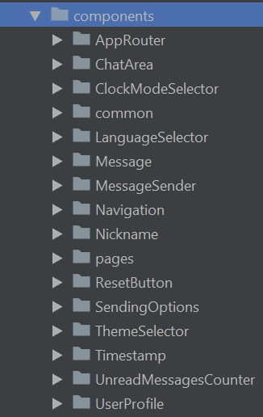
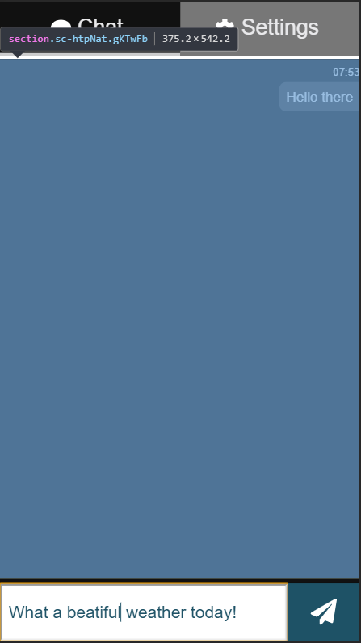
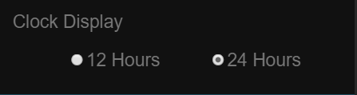
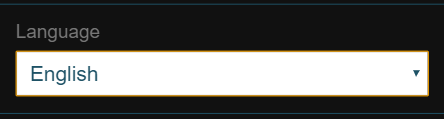
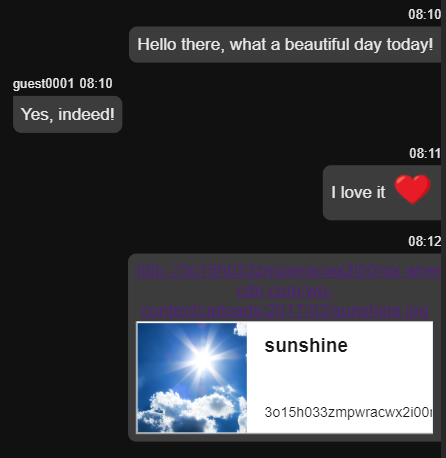
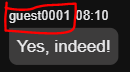
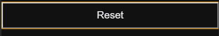
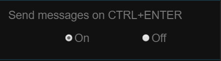
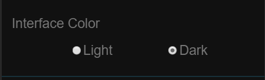
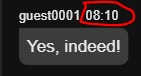

###### Photo by [Steve Halama](https://unsplash.com/photos/Yhc7YGZlz3g?utm_source=unsplash&utm_medium=referral&utm_content=creditCopyText) on [Unsplash](https://unsplash.com/search/photos/coding-chat-application?utm_source=unsplash&utm_medium=referral&utm_content=creditCopyText)


## TL;DR
This is the second part of a thorough step-by-step guide for building a single page chat application using React, TypeScript and Socket.io. If you want to take a look at the other chapters, here you go:
 - [Part I](https://mihail-gaberov.eu/how-i-build-chat-app-with-react-and-typescript-part1/)
 - [Part III](https://mihail-gaberov.eu/how-i-build-chat-app-with-react-and-typescript-part3/)
 - [Part IV](https://mihail-gaberov.eu/how-i-build-chat-app-with-react-and-typescript-part4/)

If you want to skip the reading, [here](https://github.com/mihailgaberov/chat) 💁 is the GitHub repository with a detailed [README](https://github.com/mihailgaberov/chat/blob/master/README.md) 🙌, and [here](https://mihails-chat.herokuapp.com/#/chat) you can check the live demo. 🎀 In order to play with it, you need to open it in two different browsers (or browser tabs) or devices (you may use your computer and your smartphone) and chat with each other.🎀

---

## More detailed planing
In this section we need to have a deeper look at our application and define what would be the building blocks of it. Since we are going to use React and we know that in the React world the term _component_ is widely used, we may refer to our building blocks as components. We will have components responsible for purely visual stuff, as well as such for managing the local storage for example.

Let's try to imagine mentally how our app will look in the end and what would be the components it will need. What we already know is this:

### Server part
We will need a http server that will take care of starting the server and handling interactions with Socket.io (sending and receiving messages). Our server logic will be simple enough to live in only one file. You can see the actual implementation [here](https://github.com/mihailgaberov/chat/blob/master/server/index.js).

### Client part
Here we need to have all the visual controls, plus means for managing interactions with local storage, where we will save the user preferences, as well as handling of the translations and color themes.

Now it is a good moment to point out that for implementing the [translations and theming](https://github.com/mihailgaberov/chat/blob/master/src/utilities/TranslationsProvider.tsx) functionality in the app, I have used [React Context API](https://reactjs.org/docs/context.html). Also, since I knew I will have to deal with [Local Storage](https://developer.mozilla.org/en-US/docs/Web/API/Window/localStorage), I did [another round](https://github.com/mihailgaberov/misc/tree/master/manage-local-storage-with-typescript) of "research-test-play" trip. And the output of it was that I already had a [nice service](https://github.com/mihailgaberov/chat/blob/master/src/utilities/localStorageService.ts), which provides all the functionalities I needed.

Another thing you will notice when looking at the [components](https://github.com/mihailgaberov/chat/tree/master/src/components) folder is, that every component has its own directory with a few files in it. These files serve the following logic:

 - __index.ts__ → entry point, just expose the component itself, this helps for not having to write repeatedly and long import statements. Here is an example:
```jsx 
// Instead of having to write this:
import ChatArea from '../../ChatArea/ChatArea';
// We can have just this:
import ChatArea from '../../ChatArea';
```
 - __<ComponentName>.tsx__ (e.g. ChatArea.tsx) → actual component implementation live here.
 - __<ComponentName>.test.tsx__ (e.g. ChatArea.tsx) → unit tests of the component live here.
 - __<StyledComponentName>.tsx__ (e.g. StyledChatArea.tsx) → CSS styles of the component live here.
 
 The same pattern is used for most of the components, exception are only the pages, i.e. the components which play the role of parents for all the inner parts - [ChatPage](https://github.com/mihailgaberov/chat/tree/master/src/components/pages/Chat) and [SettingsPage](https://github.com/mihailgaberov/chat/tree/master/src/components/pages/Settings).
 
 So, with that said, I think we can see what would be our application structure when we try to "_componentize_" it. Here a list of the components I came up:
 


Note: _all namings are a matter of personal choice, feel free to name yours as you wish_.

Let me try to give you a bit more detailed explanation for each of them below:

 - [AppRouter](https://github.com/mihailgaberov/chat/tree/master/src/components/AppRouter) - contains the main app routing logic, i.e. here we define the app routes by giving them path and component to load when this path is reached. Uses [React Router](https://reacttraining.com/react-router/web/guides/philosophy) package.
 - [ChatArea ](https://github.com/mihailgaberov/chat/tree/master/src/components/ChatArea) - represents the main chat area, where all the message are being displayed. It's responsible also for auto scrolling down when the visible area limit is reached.
 
 
 
 - [ClockModeSelector](https://github.com/mihailgaberov/chat/tree/master/src/components/ClockModeSelector) - responsible for displaying controls allowing the user to select the time display mode -12h or 24h. It uses a common component called [RadioGroup](https://github.com/mihailgaberov/chat/tree/master/src/components/common/RadioGroup) (will describe it below) and the Local Storage service to write/read from the browser's local storage. 



 - [common/RadioGroup](https://github.com/mihailgaberov/chat/tree/master/src/components/common/RadioGroup) - this is a common component, built with the idea to be re-usable all over the app. We use this component in a few other components, such as ClockModeSelector, [ThemeSelector](https://github.com/mihailgaberov/chat/tree/master/src/components/ThemeSelector) and [SendingOptions](https://github.com/mihailgaberov/chat/tree/master/src/components/SendingOptions). It contains logic for displaying two radio buttons with possibility to pass a callback function which will execute certain action depending on your needs.
 - [LanguageSelector](https://github.com/mihailgaberov/chat/tree/master/src/components/LanguageSelector) - responsible for displaying a select input control for choosing the app language. It accepts a function that is coming from the [TranslationsProvider](https://github.com/mihailgaberov/chat/blob/master/src/utilities/TranslationsProvider.tsx) utility and does the actual language change.



 - [Message](https://github.com/mihailgaberov/chat/tree/master/src/components/Message) - this component is responsible for displaying each chat message, sent or received. It includes the nickname of the sender and timestamp showing the time when the message was sent/received. It also provides support for emojis (e.g. ❤️) and links parsing - see the screenshot below.



- [MessageSender](https://github.com/mihailgaberov/chat/tree/master/src/components/MessageSender) - this is component that provides the necessary user interface controls for sending messages - a text input field and a Send button. It contains logic for defining the different ways of sending - via click or key press (with ENTER or CTRL+ENTER), as well as clearing the input field when a new message is sent.


 - [Navigation](https://github.com/mihailgaberov/chat/tree/master/src/components/Navigation) - here lives the implementation of the app navigation. It consists of two tabs - __Chat__ and __Settings__ and contains logic for connecting to sockets, by sending a [Redux action](https://redux.js.org/basics/actions) when the component is mounted. It manages an [UnreadMessagesCounter](https://github.com/mihailgaberov/chat/tree/master/src/components/UnreadMessagesCounter) component by passing it the count of the currently unread messages (this happens when the user receives a message while being on the Settings page). It also has a logic responsible for making the tab blinking when a new message arrives.


 - [Nickname](https://github.com/mihailgaberov/chat/tree/master/src/components/Nickname) - this is simple component for rendering the nickname of a chat user.
 
 

 - [ResetButton ](https://github.com/mihailgaberov/chat/tree/master/src/components/ResetButton) - this would be a simple component, used in __Settings__ page for rendering a Reset button, which function is going to be exactly that - resetting the settings selections that are already saved into the local storage, if any.

 

 - [SendingOptions](https://github.com/mihailgaberov/chat/tree/master/src/components/SendingOptions) - responsible for displaying options for choosing if a message can be sent via CTRL+ENTER. It works same way as ClockModeSelector component - uses RadioGroup component and accepts a callback function.
 


 - [ThemeSelector](https://github.com/mihailgaberov/chat/tree/master/src/components/ThemeSelector) - same as the component above. The only difference is that here the user is allowed to select a color theme. In our case the options are only two - light theme or dark theme.



 - [Timestamp](https://github.com/mihailgaberov/chat/tree/master/src/components/Timestamp) - simple component used for rendering the time of the messages.



 - [UnreadMessagesCounter](https://github.com/mihailgaberov/chat/tree/master/src/components/UnreadMessagesCounter) - this is the component I mentioned a little bit earlier. It shows a counter indicating the number of the received, but not yet read messages. It's positioned in the navigation area.


 - [UserProfile](https://github.com/mihailgaberov/chat/tree/master/src/components/UserProfile) - this the component responsible for rendering an input field the user can use for changing its user name. _It's saving the new user name into the local storage, using a [debounce](https://lodash.com/docs/4.17.11#debounce) function. This means that the actual triggering of the function is happening some defined time after the user stops typing_. It also triggers another Redux action, so we can be able to use the new username in our Redux state.
 - [pages/ChatPage](https://github.com/mihailgaberov/chat/tree/master/src/components/pages/Chat) - parent component that enclose everything shown on the Chat page.
 - [pages/SettingsPage](https://github.com/mihailgaberov/chat/tree/master/src/components/pages/Settings) - parent component that enclose everything shown on the Settings page.

Everything described above was related to our React components. All of them are responsible for getting some data and displaying it in a proper way. In order to be able to handle this data in a convenient for us way, we use a few more things. Let's have a look at these things in the [next chapter](https://mihail-gaberov.eu/how-i-build-chat-app-with-react-and-typescript-part3/) of this tutorial.

🔥 Thanks for reading! 🔥
