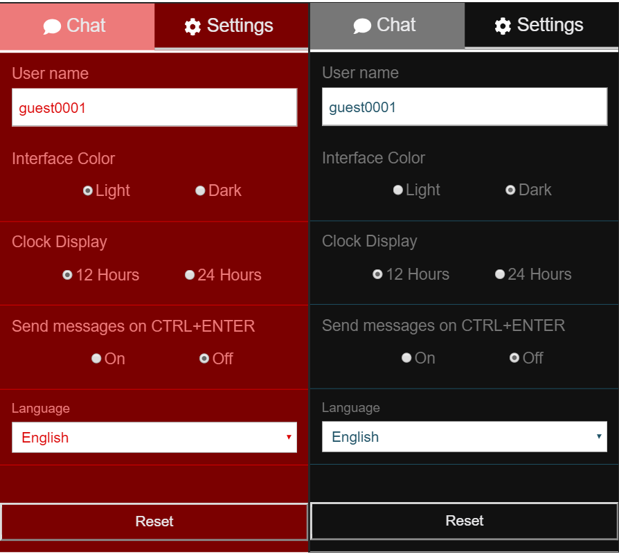

###### Photo by [Steve Halama](https://unsplash.com/photos/Yhc7YGZlz3g?utm_source=unsplash&utm_medium=referral&utm_content=creditCopyText) on [Unsplash](https://unsplash.com/search/photos/coding-chat-application?utm_source=unsplash&utm_medium=referral&utm_content=creditCopyText)


## TL;DR
This is the second part of a thorough step-by-step guide for building a single page chat application using React, TypeScript and Socket.io. If you want to take a look at the other chapters, here you go:
 - [Part I](https://mihail-gaberov.eu/how-i-build-chat-app-with-react-and-typescript-part1/)
 - [Part II](https://mihail-gaberov.eu/how-i-build-chat-app-with-react-and-typescript-part2/)
 - [Part IV](https://mihail-gaberov.eu/how-i-build-chat-app-with-react-and-typescript-part4/)

If you want to skip the reading, [here](https://github.com/mihailgaberov/chat) 💁 is the GitHub repository with a detailed [README](https://github.com/mihailgaberov/chat/blob/master/README.md) 🙌, and [here](https://mihails-chat.herokuapp.com/#/chat) you can check the live demo. 🎀 In order to play with it, you need to open it in two different browsers (or browser tabs) or devices (you may use your computer and your smartphone) and chat with each other.🎀

---
## Redux State Management
Here we will talk about how our app state is being managed by using Redux and socket middleware.

### Store
Our [store](https://github.com/mihailgaberov/chat/blob/master/src/store/index.ts) is going to be relatively simple. We will have only two reducers defining a piece of the state reserved for the socket state and for the messages state. This is also where we apply our middleware. If you are familiar with [Redux Saga](https://redux-saga.js.org/) package, you have probably seen this pattern of applying custom middleware when using Redux. Something like this:

```jsx
import { createStore, applyMiddleware } from 'redux'
import createSagaMiddleware from 'redux-saga'

import reducer from './reducers'
import mySaga from './sagas'

// create the saga middleware
const sagaMiddleware = createSagaMiddleware()
// mount it on the Store
const store = createStore(
  reducer,
  applyMiddleware(sagaMiddleware)
)
```
But in our case it would be like that:
```jsx
import { createStore, combineReducers, applyMiddleware, compose } from 'redux';
import socketReducer from './socket/reducer';
import messageReducer from './message/reducer';
import socketMiddleware from './socket/middleware';

const rootReducer = combineReducers({
  socketState: socketReducer,
  messageState: messageReducer
});

// @ts-ignore
const composeEnhancers = window.__REDUX_DEVTOOLS_EXTENSION_COMPOSE__ || compose;

const index = {
  ...createStore(rootReducer, composeEnhancers(applyMiddleware(socketMiddleware)))
};

export default index;
```

### Message
After defining our store, it's time to see how are we going to handle the messaging in Redux. We have defined our [actions](https://github.com/mihailgaberov/chat/blob/master/src/store/message/actions/index.ts) here and our [messageReducer](https://github.com/mihailgaberov/chat/blob/master/src/store/message/reducer/index.ts) here.

 - __Actions__  -  here we define the main actions needed for sending and receiving messages, as well as changing the user name.
 - __Reducer__ - here is where our messageReducer function lives and where we define what happens when one of the actions above is dispatched.
 
 ### Socket
 
We follow the same logic as above here. We have our [socket actions](https://github.com/mihailgaberov/chat/blob/master/src/store/socket/actions/index.ts), the [middleware](https://github.com/mihailgaberov/chat/tree/master/src/store/socket/middleware) I mentioned above, and the [socketReducer](https://github.com/mihailgaberov/chat/blob/master/src/store/socket/reducer/index.ts).

 -  __Actions__ - contains actions for connecting the socket (the one dispatched from the Navigation component in the beginning when the application is started) and one for when the connection status is changed, i.e. showing if we are connected or not.
  - __Middleware__ - contains implementation of a simple socket middleware, which provides us with the minimum functionality we need in our chat app.
  - __Reducer__ - here is where our socketReducer function lives and where we define what happens when one of the actions above is dispatched.

## Theming
In order to implement possibility for setting different color themes in our application and considering the fact we are using styled-components, I used a [ThemeProvider](https://www.styled-components.com/docs/advanced) - component provided by them. [Here](https://github.com/mihailgaberov/chat/blob/master/src/theme/index.ts) is the implementation that includes defining objects with custom colors used in the themes.
The logic behind applying the selected color theme resides [here](https://github.com/mihailgaberov/chat/blob/master/src/utilities/TranslationsProvider.tsx). Ideally the containing component should be named something different than TranslationsProvider, as it doesn't handle only the translations, as we see. We could add this to the list of future improvements/refactoring. Here is how the existing color themes look like:



### Utilities
In almost every software project, at certain point, the need of common reusable functions emerges. This the moment when developers usually create a common shared file or files, containing such helpers functions. In our case this would be ___/utilities___ folder, that currently contains four files. I will go through each of them below and explain the logic behind my decision to create it and put it there:

 - [common.ts](https://github.com/mihailgaberov/chat/blob/master/src/utilities/common.ts) - here is the place where I decide to put such common helper functions, which are supposed to be easily used where needed in the whole application. In this specific case you will find four functions used for time formatting, helper for defining the active page and for scrolling an element to bottom.
 - [localStorageService.ts ](https://github.com/mihailgaberov/chat/blob/master/src/utilities/localStorageService.ts)- I have already mention this service in the [first part](https://mihail-gaberov.eu/how-i-build-chat-app-with-react-and-typescript-part1/) of this tutorial. Here is where all methods for manipulating the local storage live.
 - [TranslationsProvider.tsx](https://github.com/mihailgaberov/chat/blob/master/src/utilities/TranslationsProvider.tsx) - this component was also mentioned multiple times, but for the sake of clarity I will mention it again here. It contains the logic for providing translations and color theme in the app.
 - [withTranslations.tsx](https://github.com/mihailgaberov/chat/blob/master/src/utilities/withTranslations.tsx) - this is a [higher-order component (HOC)](https://tylermcginnis.com/react-higher-order-components/) which is responsible for attaching the application context (containing the translations and themes themselves) to any component being wrapped by it. Here is an example of how is it used:

```jsx
export default withTranslations(SettingsPage as React.FunctionComponent);
```

We have walked a long way to here and we still haven't started with the actual implementation. 

>_That is a vivid pointer for us to show how important and extensive could be the planning phase of a project._

Let's jump now to the implementation phase in the [next chapter](https://mihail-gaberov.eu/how-i-build-chat-app-with-react-and-typescript-part4/).

🔥 Thanks for reading! 🔥
