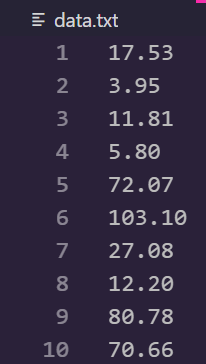
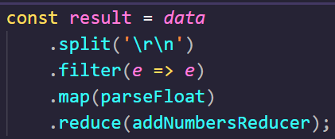
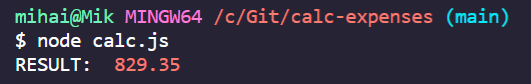

##### Recently, I had to travel through several countries by car 🚗. There were a lot of tolls to pay💰 and a lot of gasoline⛽ to fill. Which meant a lot of bills.

I collected the receipts🧾 along the way. And I planned to calculate, at the end of the trip, how much the whole journey cost me.

In the end I had a full bag of papers. Which meant that I had a lot of numbers to sum up.

I put them in a spreadsheet on my PC, ready to start calculating them by hand. And then, my programmer's mind started talking to me - why should I do all this manual work 🛠️ when I could write a short program to do it for me?

Don't get me wrong, I am aware there are a lot of other ways to do such calculations. But since I would like to call myself a programmer who loves to automate stuff, I wanted to do it myself. In the old school way.

I decided to use [Node.js](https://nodejs.org/) to solve this problem, mostly because I am quite comfortable with JavaScript. And this was supposed to be a __very quick solution__ that I came up with during a cup of coffee ☕ in the morning.

So, here is what I did:

First, I filled in all the numbers I had in a txt file, each on a new line.



Then I wrote a small program that read the data source file, parsed the numbers on a new line as a separated value to be added, and did the summing up.

```javascript
var fs = require('fs');

calculate = () => {
    fs.readFile('data.txt', 'utf8', (err, data) => {
        if (err) {
            throw new Error(err)
        }

        const arr = data.split('\r\n');
        const result = arr
            .filter(e => e)
            .map(parseFloat)
            .reduce((curr, next) => curr + next);
        console.log('RESULT: ', result);
    });
}
```
## How I built this tool
I will say a few words about the implementation first. Then we'll go through a brief discussion about what __other options__ I could have chosen.

This is a very short function that leverages a Node.js package, `fs`. It allows us to interact with the operating system (for example to read or write files to it). This is exactly what we need in order to be able to read our data source file.

The code itself follows the standard [Node.js callback mechanism](https://www.javatpoint.com/nodejs-callbacks). And inside the callback function I used a bit of a functional approach: [Piping](https://en.wikipedia.org/wiki/Pipeline_(software)) multiple methods that get the data from the previous processing, do something on it, and then pass it to the next.



The first method, `split`, parses the data that is being read from the text file by using the `\r\n` separator. These [symbols](https://en.wikipedia.org/wiki/Newline) are used in the programming world to specify when a new line (in a file) is coming.

At this stage in our program, we have our numbers that have been read and parsed from the txt file. Now we use the `filter` method. This step strips the data out of any empty values.

Then we go for the `map` method - this is a [JavaScript Array method](https://developer.mozilla.org/en-US/docs/Web/JavaScript/Reference/Global_Objects/Array/map) that accepts a callback function. This callback will be executed on each of the arguments of a given array.

In our case the data is being passed implicitly – what's coming from the `filter` method output will go as input for the `map` method. And each of the members of this input will be processed by the `parseFloat` method.

This is [another JavaScript method](https://developer.mozilla.org/en-US/docs/Web/JavaScript/Reference/Global_Objects/parseFloat) that parses an argument, converting it to string first if needed, and returns a floating point number. We need to perform this step to guarantee that we get a correct calculation.

The last step from our pipeline is the `reduce` method, a third [JavaScript Array method](https://developer.mozilla.org/en-US/docs/Web/JavaScript/Reference/Global_Objects/Array/reduce) we're going to use.

This method has [multiple applications](https://www.digitalocean.com/community/tutorials/js-finally-understand-reduce), but in our case we are using it just to sum up the numbers in the array while iterating it.

The reducer callback function that this method accepts does the real work. I have extracted mine in a separated named method to improve the readability of the code.

## What we need to do vs what we can do
In the last section I promised a brief discussion on what else we could use to achieve the same goal.

_Now it's time to stop for a moment and think about what we need to do versus what and how we can do it._

In this specific case my goal was very simple. I had some numbers that I needed to sum up automatically.

This made me think – what data structure did I need to put the data in, in order to have multiple choices for easy processing? That's how I came up with an array. After all, it's one of the simplest and most-used data structures in JavaScript.

And from here you have several options:

    1. You could do as I did in my example – use JavaScript Array methods such as map, filter, and reduce in a more functional manner. Or,

    2 .You could go the old fashioned way and use regular [loops](https://developer.mozilla.org/en-US/docs/Web/JavaScript/Guide/Loops_and_iteration) to iterate over the array and do the calculation. Such loops could be for-, while-, forEach or even do-while JavaScript loops. In such small programs the performance is negligible, so it's up to you what to use.

Both choices would work fine. What is more important here is that __you should always make your decisions based on what your end goal is.__

In this article I discussed a very short and quick to implement automation tool. It did the job I needed it to do. Given the fact I didn't have much time to invest, the first working solution was good enough.

But there will be cases where you should perform a much more sophisticated analysis in advance so that you end up with good quality software in the end.

>_Keep your end goal as your guide when deciding what to do and how to do it, and you will always be on track.

## Give it a shot
If you want to try it yourself, please make sure you have installed Node.js on your system. Then go ahead and check out this [repository](https://github.com/mihailgaberov/calc-expenses).

In order to run the program, use the following command when you're in the directory where the calc.js file is:

```bash
node calc.js
```

Check your console window to see the result. Mine looks like this:



That's all what I wanted to share with you. I hope part of this experience will stay with you for your future automation tasks.

🔥 Thanks for reading! 🔥