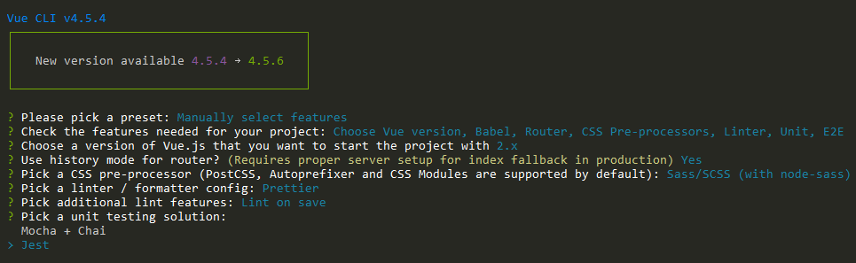

##### Let's say you are a front-end developer. Or you have just had to work more with the front end recently.

Now and then you have used some back end technologies, but you've always stayed in your comfort zone, perhaps in the JavaScript world. Or maybe you have built a small API with Python.

But you have never touched the modern .NET family tech stack.

This tutorial will guide you, step-by-step, in building a modern single page application (SPA) that will take advantage of [Vue.js](https://vuejs.org/) for the front-end and [.NET Core (C#)](https://docs.microsoft.com/en-us/dotnet/core/get-started?tabs=windows) for the back-end.

We will also see how to write some tests, both unit and integration, to cover the front and and back end functionality (at least partially).

If you want to skip the reading, [here](https://github.com/mihailgaberov/pizza-app) 💁 is the GitHub repository with a detailed [README](https://github.com/mihailgaberov/pizza-app/blob/master/README.md) 🙌.

### What Will We Build
🧑‍💻 We will build a web app where users can signup/login and just tell us how much they love pizzas, by pressing an "I love it" button.

There are no restrictions on the number of times each user can show us their appreciation. The only requirement is that only logged in users can vote.

On the home page, along with the signup/login buttons, we will put a little bar-chart, displaying the top X users with the highest appreciation (on the X-axis) and the number of votes on the Y-axis.

### Installation
Let's start with the front end. It makes more sense to build the visible parts of our app first. We will build our front end with one of the most famous front-end libraries on the market: Vue.js.

#### How to Set Up the Front End
In order to install and configure our initial front end setup with Vue.js, we will use the [Vue CLI](https://cli.vuejs.org/). This is a standard command-line tool for developing Vue.js applications.

To install it, use the following command. Note that all commands in this tutorial use [NPM](https://www.npmjs.com/), which you need to have installed on your machine in order to follow along.

```bash
npm i -g @vue/cli
```

After successfully installing the Vue CLI, we should be able to start using it to install and configure Vue.js itself. Let's do with the following process.

Step 1: Create a new empty project directory and open it with the following commands:

```bash
mkdir pizza-app
cd pizza-app
```

Step 2: While in the project root, run the following:

```bash
vue create frontend
```

Then from the provided options, select the following:

 - Manual select features


 - Babel
 - Router
 - CSS-Preprocessors (SASS)


Then select version 2.x from the next screen:


Next, select 'Use history mode for router?' and 'Sass/SCSS (with node-sass)', like so:


 - Linter / Formatter
 


 - Unit Testing with Jest



- E2E Testing with Cypress


After this last step, finish the installation process with the default options.

Now we are ready to run the app by using the following commands from the root project folder:
```bash
cd frontend
npm run serve
```

After the app is running, you can see it in your browser on http://localhost:8080:


Before going on with building the actual components that our front-end app will have, let's install our back-end app via the .NET Core CLI.

#### How to Set Up the Back End
As mentioned above, we will use another command line tool, the .NET Core CLI, that gives us the ability to create and configure .NET applications.

If you don't have it already, you may use [this link](https://dotnet.microsoft.com/download/dotnet-core/thank-you/sdk-3.1.401-windows-x64-installer) to download it and then install it.

Once you have the .NET Core CLI tool installed, go to your project's root directory and run the following command to create our back-end app. Thus we will create a folder called `backend` and install a .NET web app inside it:

```bash
dotnet new web -o backend
```

#### gitignore.io
Before continuing with installing the next packages we will need, let's sort out our .gitignore file.

This is a configuration file that tells [Git](https://git-scm.com/) what to ignore when committing changes to Git based repositories (the ones in [GitHub](https://github.com/)).

Since we want to have one .gitignore file, it will include rules for two types of applications:

 - a Node.js based one, which is our Vue.js front end, and
 - a .NET (C#) one which is our back end.

For this, we will use a tool called [gitignore.io](https://www.toptal.com/developers/gitignore). This tool will generate such files for us. The advantage of using this tool is that it allows us to type in what our programming languages/platforms are, and it generates the .gitignore file for us.


Also, at the top of the generated file, it saves links for creation or subsequent editing, as shown below.

```
# Created by https://www.toptal.com/developers/gitignore/api/webstorm,vue,vuejs,visualstudio
# Edit at https://www.toptal.com/developers/gitignore?templates=webstorm,vue,vuejs,visualstudio
```

Now we are good to go with the rest of the packages we need to install.

First we will install a package called SpaServices, which will allow us to have our app running via only one URL, and pointing to the .NET app. From its side it will proxy requests to our front-end app.

To install it, open your terminal, go to the `backend` folder of your project, and run the following:
```bash
dotnet add package Microsoft.AspNetCore.SpaServices.Extensions --version 3.1.8
```

After this, we need to configure our back-end app with the SpaServices package in order to have the desired result.

Every request will go to our .NET back-end app, and if the request is meant for the front end, it will proxy it.

To do this, open the [Startup.cs](https://github.com/mihailgaberov/pizza-app/blob/master/backend/Startup.cs) file and update its content to be like this:

```csharp
using System;
using System.Collections.Generic;
using System.Linq;
using System.Threading.Tasks;
using Microsoft.AspNetCore.Builder;
using Microsoft.AspNetCore.Hosting;
using Microsoft.AspNetCore.Http;
using Microsoft.Extensions.DependencyInjection;
using Microsoft.Extensions.Hosting;
using Microsoft.AspNetCore.Authentication.JwtBearer;
using Microsoft.EntityFrameworkCore;
using Microsoft.Extensions.Configuration;

namespace backend
{
    public class Startup
    {
        public IConfiguration Configuration { get; }

        public Startup(IConfiguration configuration)
        {
            Configuration = configuration;
        }

        // This method gets called by the runtime. Use this method to add services to the container.
        // For more information on how to configure your application, visit https://go.microsoft.com/fwlink/?LinkID=398940
        public void ConfigureServices(IServiceCollection services)
        {
            string connectionString = Configuration.GetConnectionString("DefaultConnection");
            services.AddDbContext<ApplicationDbContext>(options => options.UseSqlite(connectionString));
            services.AddSpaStaticFiles(configuration: options => { options.RootPath = "wwwroot"; });
            services.AddControllers();
            services.AddCors(options =>
            {
                options.AddPolicy("VueCorsPolicy", builder =>
                {
                    builder
                    .AllowAnyHeader()
                    .AllowAnyMethod()
                    .AllowCredentials()
                    .WithOrigins("https://localhost:5001");
                });
            });
            services.AddAuthentication(JwtBearerDefaults.AuthenticationScheme)
  .AddJwtBearer(options =>
                {
                    options.Authority = Configuration["Okta:Authority"];
                    options.Audience = "api://default";
                });
            services.AddMvc(option => option.EnableEndpointRouting = false);
        }

        // This method gets called by the runtime. Use this method to configure the HTTP request pipeline.
        public void Configure(IApplicationBuilder app, IWebHostEnvironment env, ApplicationDbContext dbContext)
        {
            if (env.IsDevelopment())
            {
                app.UseDeveloperExceptionPage();
            }

            app.UseCors("VueCorsPolicy");

            dbContext.Database.EnsureCreated();
            app.UseAuthentication();
            app.UseMvc();
            app.UseRouting();
            app.UseEndpoints(endpoints => { endpoints.MapControllers(); });
            app.UseSpaStaticFiles();
            app.UseSpa(configuration: builder =>
            {
                if (env.IsDevelopment())
                {
                    builder.UseProxyToSpaDevelopmentServer("http://localhost:8080");
                }
            });
        }
    }
}
```
💡 This is the final version of the Startup.cs file and that's why you probably noticed some more stuff in it. We will get back to this a bit later in this tutorial.

At this point, you should be able to run your back-end app. If you wish to do so, run the following commands from the root folder of your project:

```bash
cd backend
dotnet run
```

### How to Set Up Authentication
As you may remember from the description at the beginning, our app should have a Sign up/Login option.

In order to fulfill this requirement, we will use a 3rd party service called [Okta](https://www.okta.com/). We will install the necessary packages for using the Okta SDK on both the front end and back end of our app.

But before that, you need to create an account on their [website](https://developer.okta.com/) and get access to their admin panel. From there you may create a new application. Here is how it looks on mine:


Now let's start with the package we need for our front end. From the root folder, run the following commands:

```bash
cd frontend
npm i @okta/okta-vue
```
After this step, we are ready to amend our Vue.js app in order to take advantage of Okta SDK.

We will also install another package, called [BootstrapVue](https://bootstrap-vue.org/), that provides a set of good looking and ready to use Vue.js components. This will help us save development time and will also get us a good looking front end.

To install it, run the following from your `frontend` folder:
```bash
npm i vue bootstrap-vue bootstrap
```

### How to Set Up the Router
It's time to do some coding. We need to edit our [router](https://router.vuejs.org/) in order to apply what's coming from Okta authentication services.

You can see the [full file](https://github.com/mihailgaberov/pizza-app/blob/master/frontend/src/router/index.js) in my GitHub repo, but here is the essential part that you need to configure with your own details (that you got when you registered on the Okta developer website):

```js
Vue.use(Auth, {
  issuer: 'https://dev-914982.okta.com/oauth2/default',
  client_id: '0oatq53f87ByM08MQ4x6',
  redirect_uri: 'https://localhost:5001/implicit/callback',
  scope: 'openid profile email'
})

....

router.beforeEach(Vue.prototype.$auth.authRedirectGuard())
```

#### Home screen
After we get our router sorted, we can finally do some changes to our app's home screen, which will actually be visible to our users.

Open the [App.vue](https://github.com/mihailgaberov/pizza-app/blob/master/frontend/src/App.vue) file in your IDE and change its content as follows:
```js
<template>
  <div id="app">
    <header>
      <b-navbar toggleable="md" type="light" variant="light">
        <b-navbar-toggle target="nav-collapse"></b-navbar-toggle>
        <b-navbar-brand to="/">Love Pizza</b-navbar-brand>
        <b-collapse is-nav id="nav-collapse">
          <b-navbar-nav>
            <b-nav-item href="#" @click.prevent="login" v-if="!user">Login</b-nav-item>
            <b-nav-item href="#" @click.prevent="logout" v-else>Logout</b-nav-item>
          </b-navbar-nav>
        </b-collapse>
      </b-navbar>
    </header>
    <main>
      <div>
        Love pizza button and clicks counter here
      </div>
    </main>
  </div>
</template>

<script>
export default {
  name: 'app',
  data() {
    return {
      user: null
    }
  },
  async created() {
    await this.refreshUser()
  },
  watch: {
    '$route': 'onRouteChange'
  },
  methods: {
    login() {
      this.$auth.loginRedirect()
    },
    async onRouteChange() {
      await this.refreshUser()
    },
    async refreshUser() {
      this.user = await this.$auth.getUser()
    },
    async logout() {
      await this.$auth.logout()
      await this.refreshUser()
      this.$router.push('/')
    }
  }
}
</script>

<style lang="scss">
#app {
  font-family: Avenir, Helvetica, Arial, sans-serif;
  -webkit-font-smoothing: antialiased;
  -moz-osx-font-smoothing: grayscale;
  text-align: center;
  color: #2c3e50;
}

#nav {
  padding: 30px;

  a {
    font-weight: bold;
    color: #2c3e50;

    &.router-link-exact-active {
      color: #42b983;
    }
  }
}
</style>
```

By now your app might look something like this:


__Note__: Don't be confused by the text 'Pizza button and clicks counter here'. When building UIs, it's a good practice to leave such placeholders for components that are to be developed in the future.

In our case, this is where we will add the components responsible for the 'I love it' button and the counter later. They will show the number of votes per user.

```html
<main>
  <div>
  	Love pizza button and clicks counter here
  </div>
</main>
```

#### Authentication on the back end
By now, we have setup our front end to leverage the authentication service provided by Okta. But in order to have the whole picture ready to use, we need to do the same in our back-end app.

This is where we will be doing HTTP calls from, in order to communicate with the database. And, as you will see later, some of these calls will need to be authenticated in order to succeed.

Let's start again with installing some packages that will make our job easier. In your terminal, go to your `backend` directory and run the following:

```bash
dotnet add package Microsoft.AspNetCore.Authentication.JwtBearer --version 3.1.8
dotnet add package Microsoft.Extensions.Configuration --version 3.1.7
```

Then we need another package that will help us set up our database. We will use the SQLite database which is super easy to use in .NET Core setup.

While still in the `backend` folder, run:

```bash
dotnet add package Microsoft.EntityFrameworkCore.Sqlite --version 2.1.1
```

Once we're finished with the installations, make sure you got the full content of [Startup.cs](https://github.com/mihailgaberov/pizza-app/blob/master/backend/Startup.cs) file (and if you didn't, do so now).

#### PizzaVotesApiService
OK everyone, we have set up both our front and back ends to support authentication. We have added SQLite as a database to be used for storing the users votes. And we have an initial version of our home screen.

Now it's time to implement a service on the front end that will allow us to consume our back end API.

Great job so far! 🙌

Before being able to make HTTP calls from our front end app to our back end app, we need to install one more package in our Vue.js app. It's called [axios](https://www.npmjs.com/package/axios) and it gives us the ability to make [XMLHttpRequests](https://developer.mozilla.org/en-US/docs/Web/API/XMLHttpRequest) from the browser, which is exactly what we need.

Open your terminal, go to the `frontend` of your project, and run:

```bash
npm i axious
```

Then, in your IDE, go to the `src` folder of your front-end app, create a new .js file, and add the following inside it:

```js
import Vue from 'vue'
import axios from 'axios'

const client = axios.create({
    baseURL: 'http://localhost:5000/api/pizzavotes',
    json: true
})

export default {
    async execute(method, resource, data) {
        const accessToken = await Vue.prototype.$auth.getAccessToken()
        return client({
            method,
            url: resource,
            data,
            headers: {
                Authorization: `Bearer ${accessToken}`
            }
        }).then(req => {
            return req.data
        })
    },
    getAll() {
        return this.execute('get', '/')
    },
    getById(id) {
        return this.execute('get', `/${id}`)
    },
    create(data) {
        return this.execute('post', '/', data)
    },
    update(id, data) {
        return this.execute('put', `/${id}`, data)
    },
}
```

I have named mine [PizzaVotesApiService.js](https://github.com/mihailgaberov/pizza-app/blob/master/frontend/src/PizzaVotesApiService.js). We will stop with integrating the API for a while and will create another component that will hold the controls the users will use to interact with this API.


#### Dashboard Component
Say hello to our [Dashboard.vue](https://github.com/mihailgaberov/pizza-app/blob/master/frontend/src/components/Dashboard.vue) component.

This is where we will put the 'I love it' button and a small votes counter.


We'll also add a nice pizza image.


As well as a nice bar chart, showing the top X voters.


You may copy and paste the full content of the file from my repo so we can continue with integrating the whole thing.

### API Integration
I am going to use a small diagram to depict the data flow. As they say, "a picture is worth a thousand words:"


As you can see (I hope 🤓) from the diagram, when the user enters their votes, the data goes from the dashboard component through the API service we created for communicating with the back-end API. It then reaches the back-end controller that is actually making the HTTP calls.

Once the data is fetched, the service passes it back to our UI where we show it via our Vue.js components. As you will see, there is some additional logic that checks if the user is authenticated in order to know which calls to execute.

Here is the implementation of the [controller](https://github.com/mihailgaberov/pizza-app/blob/master/backend/PizzaVotesController.cs) itself:

```csharp
using System.Collections.Generic;
using System.Threading.Tasks;
using Microsoft.AspNetCore.Authorization;
using Microsoft.AspNetCore.Mvc;
using Microsoft.EntityFrameworkCore;

namespace backend.Controllers
{
    [Route("api/[controller]")]
    [ApiController]
    public class PizzaVotesController : ControllerBase
    {
        private readonly ApplicationDbContext _dbContext;

        public PizzaVotesController(ApplicationDbContext dbContext)
        {
            _dbContext = dbContext;
        }

        // GET api/pizzavotes
        [HttpGet]
        public async Task<ActionResult<List<PizzaVotes>>> Get()
        {
            return await _dbContext.PizzaVotes.ToListAsync();
        }

        // GET api/pizzavotes/{email}
        [Authorize]
        [HttpGet("{id}")]
        public async Task<ActionResult<PizzaVotes>> Get(string id)
        {
            return await _dbContext.PizzaVotes.FindAsync(id);
        }

        // POST api/pizzavotes
        [Authorize]
        [HttpPost]
        public async Task Post(PizzaVotes model)
        {
            await _dbContext.AddAsync(model);
            await _dbContext.SaveChangesAsync();
        }

        // PUT api/pizzavotes/{email}
        [Authorize]
        [HttpPut("{id}")]
        public async Task<ActionResult> Put(string id, PizzaVotes model)
        {
            var exists = await _dbContext.PizzaVotes.AnyAsync(f => f.Id == id);
            if (!exists)
            {
                return NotFound();
            }

            _dbContext.PizzaVotes.Update(model);

            await _dbContext.SaveChangesAsync();

            return Ok();
        }
    }
}
```

Here we have four methods for executing four basic operations:

 - get all records from the database
 - get the records for one user (by their email address)
 - create a new user record
 - update an existing user's records.

You have probably noticed the `[Authorize]` clause above in three of the four methods. Those methods are going to require the user to be authenticated in order to execute.

We will leave the method `GET api/pizzavotes` for getting all records unauthorized on purpose. Since we would like to show the bar chart on the home screen to all users, we will need to be able to make this call, no matter if the user is authenticated or not.

#### Allow registration
Something to note: if you would like to have a 'Sign Up' on your login screen, you need to allow it from the Okta admin panel.

Once logged in, select from the menu __Users->Registration__:


#### Finish the back end
In order for your back-end app to become fully functioning, please take a look at [my repo here](https://github.com/mihailgaberov/pizza-app/tree/master/backend) and add the missing files.

If you have followed along up to this point you should have the following files (except the `test` folder, as we are going to add it a bit later):


#### Finish the front end
In order to finalize the work on our front end app, we will create two more components.

The first one will render the bar chart mentioned above, and the second one will display the email address of the user that is currently logged in.

In your IDE, go to `frontend/src/components` and create two files, named [Username.vue](https://github.com/mihailgaberov/pizza-app/blob/master/frontend/src/components/Username.vue) and [VotesChart.vue](https://github.com/mihailgaberov/pizza-app/blob/master/frontend/src/components/VotesChart.vue), respectively.

Username.vue is a very short and simple component that takes the user's email address as a prop and renders it. Here is its implementation:

```js
<template>
  <div class="username">{{ username }}</div>
</template>

<script>
export default {
  props: { username: String },
}
</script>

<style lang="scss">
.username {
  color: rebeccapurple;
  display: flex;
  align-items: center;
  justify-content: center;
}

.username::before {
  content: "•";
}

.username::after {
  content: "•";
}
</style>
```

The only thing to notice here is that we are using SASS/SCSS for the component styles. That is possible because we chose that option in the beginning (when we were installing our Vue.js app).

For drawing the chart we will use a package called [vue-chartsjs](https://www.npmjs.com/package/vue-chartjs). Install it by running the following command from your `frontend` folder:

```bash
npm i vue-chartjs chart.js
```

Our component __VotesChart.vue__ is going to be kind of wrapper for the bar chart component that comes from the vue-chartjs package.

We use it for getting the data from the parent component, __Dashboard.vue__, and processing it.

We sort the data array in order to display our top voters, sorted from the largest to the smallest number of votes. Then we pass it to the Bar chart component to visualize it.

Here is the full implementation:

```js
<script>
import { Bar } from 'vue-chartjs'

const TOP_N_VOTERS_TO_SHOW_ON_CHART = 10

// Used to sort by votes value - from bigger to smaller (desc)
function sortByStartDate(nextUser, currentUser) {
  const nextVoteValue = nextUser.value
  const currentVoteValue = currentUser.value
  return currentVoteValue - nextVoteValue
}

export default {
  extends: Bar,
  props: { data: Array },

  watch: {
    data: async function (newVal) {
      const sortedVotes = Array.from(newVal).sort(sortByStartDate).slice(0, TOP_N_VOTERS_TO_SHOW_ON_CHART)
      this.labels = sortedVotes.map(user => user.id)
      this.values = sortedVotes.map(user => user.value)

      this.renderChart({
        labels: this.labels,
        datasets: [
          {
            label: 'Pizza Lovers',
            backgroundColor: '#f87979',
            data: this.values,
          }
        ]
      }, {
        scales: {
          yAxes: [{
            ticks: {
              stepSize: 1,
              min: 0,
              max: this.values[0]
            }
          }]
        }
      })
    }
  }
}
</script>
```

Note that there is a constant at the top of the file which will define how many top voters we would like to show on this chart. Currently it is set to 10, but you can amend it as you like.

Once you are ready with all the front-end stuff and want to run the app, you can do so by:

Going to the `frontend` folder and running:

```bash
npm run serve
```

Going to the `backend` folder and running:

```bash
dotnet run
```

Opening your browser and going to https://localhost:5001.


### How to test our applications
So far we have built a modern and fully functioning single page application with a .NET Core back end and a SQLite database. That's a lot of work. Congrats! ✨

We easily could stop here and go have some cold 🍺.

But...

We are reasonable enough to know that if we don't test our apps, we can't guarantee that they will work as expected.

We also know that if we want to make our code testable, we should write in a well structured manner, keeping in mind the [main principles of software design](https://www.dotnettricks.com/learn/designpatterns/different-types-of-software-design-principles).

I hope I've convinced you to continue working through this tutorial. After all, the only thing left for us to do is to write some tests for both of our applications. So let's do it!

We will cover the functioning of our back end API with __integration tests__, and for our front end we will write both __unit__ and __integration__ tests.

#### Unit and integration tests
💡 Before going to the code, I would like to say a few words about these types of tests and answer some of most frequently asked questions.

You might be wondering, what are unit tests? What are integrations tests? Why do we need them? When should we use each of them?

Starting from the first question, a __unit test__ is a piece of code that tests the functionality of an encapsulated module (meaning another piece). It's written in as a function or some kind of independent block of code.

They are good to have, because they give you quick development time feedback and keep the code safe from regressions when new features are being added.

__Integration tests__ are useful when we need to test how multiple modules/units are working together. For example a REST API and a database interaction.

Depending on the size of the application we are working on, we might need only integration tests. But sometimes we need both integration and unit tests to bullet proof our code.

Ideally, we should have them both, as they are essential parts of the testing pyramid and are the cheapest to implement.

But in some cases, like for our back end app, only integration tests are necessary to cover the functionality that is worth being tested. We have only several API methods for working with the database.

#### How to Create Our Back End Tests
This time we will start with creating our test solution. To do so, you need to do a few things.

First, install the xUnit library by running the following from your project root directory:

```bash
dotnet add package xUnit
```

Then go to your `backend` folder and create and empty folder called `tests` . Then inside that folder run:

```bash
dotnet new xunit -o PizzaVotes.Tests
```

Once that's done, open [backend.csproj](https://github.com/mihailgaberov/pizza-app/blob/master/backend/backend.csproj) and add the following two lines to the `<PropertyGroup>` block:

```
<GenerateAssemblyInfo>false</GenerateAssemblyInfo>
<GenerateTargetFrameworkAttribute>false</GenerateTargetFrameworkAttribute>
```

Then go to your `tests` folder and install the following packages:

```
Microsoft.AspNetCore.Mvc
Microsoft.AspNetCore.Mvc.Core
Microsoft.AspNetCore.Diagnostics
Microsoft.AspNetCore.TestHost
Microsoft.Extensions.Configuration.Json
Microsoft.AspNetCore.Mvc.Testing
```

You do that by executing each of the following commands in your terminal app:

```bash
dotnet add package Microsoft.AspNetCore.Mvc --version 2.2.0
dotnet add package Microsoft.AspNetCore.Mvc.Core --version 2.2.5
dotnet add package Microsoft.AspNetCore.Diagnostics --version 2.2.0
dotnet add package Microsoft.AspNetCore.TestHost --version 3.1.8
dotnet add package Microsoft.AspNetCore.Mvc.Testing --version 3.1.8
```

After we have everything installed, we are ready to proceed to actually writing some tests.

As you may see here, except the tests themselves, I have added two more files which we need or are good to have when running the tests.

One of them is just a [helper file](https://github.com/mihailgaberov/pizza-app/blob/master/backend/tests/PizzaVotes.Tests/ContentHelper.cs) with one method for dealing with serialized objects and getting the string content. The other is the [fixture file](https://github.com/mihailgaberov/pizza-app/blob/master/backend/tests/PizzaVotes.Tests/TestFixture.cs), where we have configurations and settings for our test server and client.

And, of course, there's [a file](https://github.com/mihailgaberov/pizza-app/blob/master/backend/tests/PizzaVotes.Tests/PizzaVotesTests.cs) with our tests.

I am not going to paste the content of these files here, as this tutorial has become long enough already.  

__You can just copy them from my repository.__

If you take a closer look at the tests, you might notice that we are testing only the first, not authenticated, call for a success response. The rest we are checking only for 401 HTTP response, which is `Unautorized`.

That's because only the first method is public, that is, it doesn't need authentication.

If we were to have the same tests for all methods, we would have needed to implement a middleware just to authorize our test app in front of Okta's authentication services.

And since the purpose of this tutorial is to learn a variety of things, we might say it's not worth doing.

Now the fun part: how to run the tests. It turns out to be super simple. Just go to your `tests` directory (where the tests.sln file is) from your terminal and run:

```bash
dotnet test
```

You should see something like this in your terminal (ignore the yellow warnings):


#### How to Create Our Front-end Tests
It's time to add some tests to our front end. Here we will do both unit and integration tests.

##### Unit tests
As I mentioned above, unit tests are suitable when we have a module or a component that doesn't have dependencies from the outside world.

Such components turn out to be our Username.vue and VotesChart.vue components.

They are representational components that receive the data they need to function properly via props. This means we can write our tests in the same manner: pass them the data they need and check whether the results of their execution are as expected.

Here's an important thing to mention. It's not that what is provided by the __@vue/test-utils__ package (that comes from installing Vue.js), was not enough to test both components.

Rather, for educational purposes, I have decided to install and use the [Vue Testing Library](https://testing-library.com/docs/vue-testing-library/intro) as well. That's why one of the components below is tested with @vue/test-utils, but the other is tested with @testing-library/vue.

Don't forget to install it before running the test:

```bash
npm i --save-dev @testing-library/vue
```

Again, to save space, I am not going to paste the component test's code here, but you can easily see it [here](https://github.com/mihailgaberov/pizza-app/blob/master/frontend/tests/unit/Username.spec.js) and [here](https://github.com/mihailgaberov/pizza-app/blob/master/frontend/tests/unit/VotesChart.spec.js).

Then in order to run the unit tests of your front-end app, go to the `frontend` folder and execute:

```bash
npm run test:unit
```

##### Integration test
This is probably more interesting for some of you.

If you remember the beginning of this tutorial when we installed our Vue.js app, for our e2e (or integartion) tests solution we selected [Cypress.js](https://www.cypress.io/).

This is a super easy-to-use tool that allows developers to write real e2e tests for their applications by giving them immediate feedback.

From personal experience I would say that working with Cypress is more of a pleasure than with other similar frameworks. If you have previous experience with frameworks like Nightwatch.js or Selenium, what you see below might be familiar to you.

Before running our tests with Cypress, we need to do some minor changes in its configuration.

Find the [index file](https://github.com/mihailgaberov/pizza-app/blob/master/frontend/tests/e2e/plugins/index.js) under the `plugins` folder and add the following line to the return statement in the end of the file:

```js
  baseUrl: "https://localhost:5001"
```

Now update the content of the test.js under the `specs` folder as it's shown [here](https://github.com/mihailgaberov/pizza-app/blob/master/frontend/tests/e2e/specs/test.js).

Once you have it all done, you should be able to run your e2e tests via Cypress. You can do so by executing the following command while you're in your `frontend` directory:

```bash
npm run test:e2e
```

⚡Don't forget to start your back-end app before executing the e2e tests so that they work properly.

If you have followed along, after running the command above you should see something like this in your terminal:


And a new browser window will be opened by Cyrpess.js itself, where you can use the provided UI to see and run your tests.


And when all tests pass, you are supposed to see a screen like this:


### Conclusion
In this tutorial, we have seen how to use one of the hottest technologies on the market, for both the front end and back end.

We've also learned how to combine them properly in order to build a small but fully functioning single page application with database support.

Finally, we also have written unit and integration tests for both ends.

I believe this kind of exercise is beneficial for both experienced and beginner readers, as it covers a lot of different stuff in a step-by-step manner. And you end up with a working example app if you've finished the entire process.

This tutorial ended up being much longer than I initially thought it would be. But if you have done it all, I admire you 🙏! And I hope it was pleasure for you reading it, as it was for me writing it.

🔥 Thanks for reading! 🔥


### Resources
You may find below the links that were useful to me in some way while writing this.

https://consultwithgriff.com/spas-with-vuejs-aspnetcore/
https://github.com/okta/okta-auth-dotnet
https://docs.microsoft.com/en-us/dotnet/core/testing/unit-testing-with-dotnet-test
https://docs.microsoft.com/en-us/dotnet/api/system.net.http.httpresponsemessage?view=netcore-3.1
https://vue-test-utils.vuejs.org/guides/#testing-key-mouse-and-other-dom-events
https://docs.cypress.io/guides/references/configuration.html#Options
https://docs.cypress.io/guides/tooling/visual-testing.html#Functional-vs-visual-testing
https://www.codingame.com/playgrounds/35462/creating-web-api-in-asp-net-core-2-0/part-3---integration-tests
https://testing-library.com/docs/vue-testing-library/intro
https://www.valentinog.com/blog/canvas/
