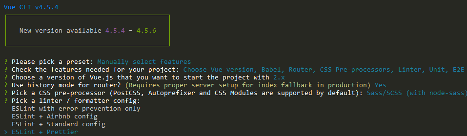

##### Let's say you are a front-end developer. Or you have just had to work more with the front end recently.

Now and then you have used some back end technologies, but you've always stayed in your comfort zone, perhaps in the JavaScript world. Or maybe you have built a small API with Python.

But you have never touched the modern .NET family tech stack.

This tutorial will guide you, step-by-step, in building a modern single page application (SPA) that will take advantage of [Vue.js](https://vuejs.org/) for the front-end and [.NET Core (C#)](https://docs.microsoft.com/en-us/dotnet/core/get-started?tabs=windows) for the back-end.

We will also see how to write some tests, both unit and integration, to cover the front and and back end functionality (at least partially).

If you want to skip the reading, [here](https://github.com/mihailgaberov/pizza-app) 💁 is the GitHub repository with a detailed [README](https://github.com/mihailgaberov/pizza-app/blob/master/README.md) 🙌.

### What Will We Build
🧑‍💻 We will build a web app where users can signup/login and just tell us how much they love pizzas, by pressing an "I love it" button.

There are no restrictions on the number of times each user can show us their appreciation. The only requirement is that only logged in users can vote.

On the home page, along with the signup/login buttons, we will put a little bar-chart, displaying the top X users with the highest appreciation (on the X-axis) and the number of votes on the Y-axis.

### Installation
Let's start with the front end. It makes more sense to build the visible parts of our app first. We will build our front end with one of the most famous front-end libraries on the market: Vue.js.

#### How to Set Up the Front End
In order to install and configure our initial front end setup with Vue.js, we will use the [Vue CLI](https://cli.vuejs.org/). This is a standard command-line tool for developing Vue.js applications.

To install it, use the following command. Note that all commands in this tutorial use [NPM](https://www.npmjs.com/), which you need to have installed on your machine in order to follow along.

```bash
npm i -g @vue/cli
```

After successfully installing the Vue CLI, we should be able to start using it to install and configure Vue.js itself. Let's do with the following process.

Step 1: Create a new empty project directory and open it with the following commands:

```bash
mkdir pizza-app
cd pizza-app
```

Step 2: While in the project root, run the following:

```bash
vue create frontend
```

Then from the provided options, select the following:

 - Manual select features


 - Babel
 - Router
 - CSS-Preprocessors (SASS)


Then select version 2.x from the next screen:


Next, select 'Use history mode for router?' and 'Sass/SCSS (with node-sass)', like so:


 - Linter / Formatter
 


 - Unit Testing with Jest


- E2E Testing with Cypress


After this last step, finish the installation process with the default options.

Now we are ready to run the app by using the following commands from the root project folder:
```bash
cd frontend
npm run serve
```

After the app is running, you can see it in your browser on http://localhost:8080:


Before going on with building the actual components that our front-end app will have, let's install our back-end app via the .NET Core CLI.

#### How to Set Up the Back End
As mentioned above, we will use another command line tool, the .NET Core CLI, that gives us the ability to create and configure .NET applications.

If you don't have it already, you may use [this link](https://dotnet.microsoft.com/download/dotnet-core/thank-you/sdk-3.1.401-windows-x64-installer) to download it and then install it.

Once you have the .NET Core CLI tool installed, go to your project's root directory and run the following command to create our back-end app. Thus we will create a folder called `backend` and install a .NET web app inside it:

```bash
dotnet new web -o backend
```

#### gitignore.io
Before continuing with installing the next packages we will need, let's sort out our .gitignore file.

This is a configuration file that tells [Git](https://git-scm.com/) what to ignore when committing changes to Git based repositories (the ones in [GitHub](https://github.com/)).

Since we want to have one .gitignore file, it will include rules for two types of applications:

 - a Node.js based one, which is our Vue.js front end, and
 - a .NET (C#) one which is our back end.

For this, we will use a tool called [gitignore.io](https://www.toptal.com/developers/gitignore). This tool will generate such files for us. The advantage of using this tool is that it allows us to type in what our programming languages/platforms are, and it generates the .gitignore file for us.


Also, at the top of the generated file, it saves links for creation or subsequent editing, as shown below.

```
# Created by https://www.toptal.com/developers/gitignore/api/webstorm,vue,vuejs,visualstudio
# Edit at https://www.toptal.com/developers/gitignore?templates=webstorm,vue,vuejs,visualstudio
```

Now we are good to go with the rest of the packages we need to install.

First we will install a package called SpaServices, which will allow us to have our app running via only one URL, and pointing to the .NET app. From its side it will proxy requests to our front-end app.

To install it, open your terminal, go to the `backend` folder of your project, and run the following:
```bash
dotnet add package Microsoft.AspNetCore.SpaServices.Extensions --version 3.1.8
```

After this, we need to configure our back-end app with the SpaServices package in order to have the desired result.

Every request will go to our .NET back-end app, and if the request is meant for the front end, it will proxy it.

To do this, open the [Startup.cs](https://github.com/mihailgaberov/pizza-app/blob/master/backend/Startup.cs) file and update its content to be like this:

```csharp
using System;
using System.Collections.Generic;
using System.Linq;
using System.Threading.Tasks;
using Microsoft.AspNetCore.Builder;
using Microsoft.AspNetCore.Hosting;
using Microsoft.AspNetCore.Http;
using Microsoft.Extensions.DependencyInjection;
using Microsoft.Extensions.Hosting;
using Microsoft.AspNetCore.Authentication.JwtBearer;
using Microsoft.EntityFrameworkCore;
using Microsoft.Extensions.Configuration;

namespace backend
{
    public class Startup
    {
        public IConfiguration Configuration { get; }

        public Startup(IConfiguration configuration)
        {
            Configuration = configuration;
        }

        // This method gets called by the runtime. Use this method to add services to the container.
        // For more information on how to configure your application, visit https://go.microsoft.com/fwlink/?LinkID=398940
        public void ConfigureServices(IServiceCollection services)
        {
            string connectionString = Configuration.GetConnectionString("DefaultConnection");
            services.AddDbContext<ApplicationDbContext>(options => options.UseSqlite(connectionString));
            services.AddSpaStaticFiles(configuration: options => { options.RootPath = "wwwroot"; });
            services.AddControllers();
            services.AddCors(options =>
            {
                options.AddPolicy("VueCorsPolicy", builder =>
                {
                    builder
                    .AllowAnyHeader()
                    .AllowAnyMethod()
                    .AllowCredentials()
                    .WithOrigins("https://localhost:5001");
                });
            });
            services.AddAuthentication(JwtBearerDefaults.AuthenticationScheme)
  .AddJwtBearer(options =>
                {
                    options.Authority = Configuration["Okta:Authority"];
                    options.Audience = "api://default";
                });
            services.AddMvc(option => option.EnableEndpointRouting = false);
        }

        // This method gets called by the runtime. Use this method to configure the HTTP request pipeline.
        public void Configure(IApplicationBuilder app, IWebHostEnvironment env, ApplicationDbContext dbContext)
        {
            if (env.IsDevelopment())
            {
                app.UseDeveloperExceptionPage();
            }

            app.UseCors("VueCorsPolicy");

            dbContext.Database.EnsureCreated();
            app.UseAuthentication();
            app.UseMvc();
            app.UseRouting();
            app.UseEndpoints(endpoints => { endpoints.MapControllers(); });
            app.UseSpaStaticFiles();
            app.UseSpa(configuration: builder =>
            {
                if (env.IsDevelopment())
                {
                    builder.UseProxyToSpaDevelopmentServer("http://localhost:8080");
                }
            });
        }
    }
}
```
💡 This is the final version of the Startup.cs file and that's why you probably noticed some more stuff in it. We will get back to this a bit later in this tutorial.

At this point, you should be able to run your back-end app. If you wish to do so, run the following commands from the root folder of your project:

```bash
cd backend
dotnet run
```

### How to Set Up Authentication
As you may remember from the description at the beginning, our app should have a Sign up/Login option.

In order to fulfill this requirement, we will use a 3rd party service called [Okta](https://www.okta.com/). We will install the necessary packages for using the Okta SDK on both the front end and back end of our app.

But before that, you need to create an account on their [website](https://developer.okta.com/) and get access to their admin panel. From there you may create a new application. Here is how it looks on mine:


Now let's start with the package we need for our front end. From the root folder, run the following commands:

```bash
cd frontend
npm i @okta/okta-vue
```
After this step, we are ready to amend our Vue.js app in order to take advantage of Okta SDK.

We will also install another package, called [BootstrapVue](https://bootstrap-vue.org/), that provides a set of good looking and ready to use Vue.js components. This will help us save development time and will also get us a good looking front end.

To install it, run the following from your `frontend` folder:
```bash
npm i vue bootstrap-vue bootstrap
```

### How to Set Up the Router
It's time to do some coding. We need to edit our [router](https://router.vuejs.org/) in order to apply what's coming from Okta authentication services.

You can see the [full file](https://github.com/mihailgaberov/pizza-app/blob/master/frontend/src/router/index.js) in my GitHub repo, but here is the essential part that you need to configure with your own details (that you got when you registered on the Okta developer website):

```js
Vue.use(Auth, {
  issuer: 'https://dev-914982.okta.com/oauth2/default',
  client_id: '0oatq53f87ByM08MQ4x6',
  redirect_uri: 'https://localhost:5001/implicit/callback',
  scope: 'openid profile email'
})

....

router.beforeEach(Vue.prototype.$auth.authRedirectGuard())
```

#### Home screen
After we get our router sorted, we can finally do some changes to our app's home screen, which will actually be visible to our users.

Open the [App.vue](https://github.com/mihailgaberov/pizza-app/blob/master/frontend/src/App.vue) file in your IDE and change its content as follows:
```js
<template>
  <div id="app">
    <header>
      <b-navbar toggleable="md" type="light" variant="light">
        <b-navbar-toggle target="nav-collapse"></b-navbar-toggle>
        <b-navbar-brand to="/">Love Pizza</b-navbar-brand>
        <b-collapse is-nav id="nav-collapse">
          <b-navbar-nav>
            <b-nav-item href="#" @click.prevent="login" v-if="!user">Login</b-nav-item>
            <b-nav-item href="#" @click.prevent="logout" v-else>Logout</b-nav-item>
          </b-navbar-nav>
        </b-collapse>
      </b-navbar>
    </header>
    <main>
      <div>
        Love pizza button and clicks counter here
      </div>
    </main>
  </div>
</template>

<script>
export default {
  name: 'app',
  data() {
    return {
      user: null
    }
  },
  async created() {
    await this.refreshUser()
  },
  watch: {
    '$route': 'onRouteChange'
  },
  methods: {
    login() {
      this.$auth.loginRedirect()
    },
    async onRouteChange() {
      await this.refreshUser()
    },
    async refreshUser() {
      this.user = await this.$auth.getUser()
    },
    async logout() {
      await this.$auth.logout()
      await this.refreshUser()
      this.$router.push('/')
    }
  }
}
</script>

<style lang="scss">
#app {
  font-family: Avenir, Helvetica, Arial, sans-serif;
  -webkit-font-smoothing: antialiased;
  -moz-osx-font-smoothing: grayscale;
  text-align: center;
  color: #2c3e50;
}

#nav {
  padding: 30px;

  a {
    font-weight: bold;
    color: #2c3e50;

    &.router-link-exact-active {
      color: #42b983;
    }
  }
}
</style>
```
