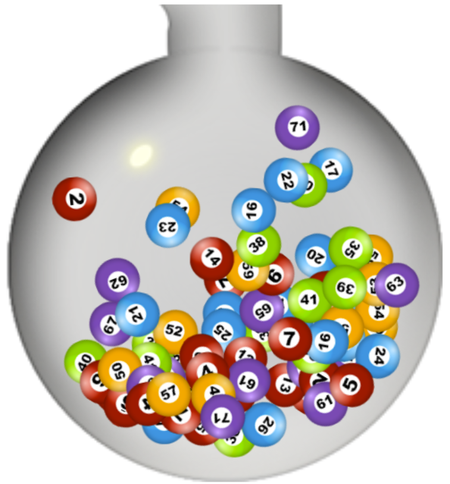
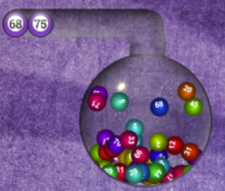

>_Have you ever wondered how can you create a realistic ball blowing effect with JavaScript? Like the one shown in the evening TV shows, where multiple balls are being mixed in a sphere-like object by leveraging air pressure. If you have answered with 'yes', please keep reading below._

---

✨ If you want to skip the reading and jump straight to the code, you will find it [here](https://github.com/mihailgaberov/bingo-blower). Also, I have deployed a [live demo here](https://tender-hoover-fdc559.netlify.app).✨

## Research
Recently I have decided to refurbish something old, that I did 4 years ago for a [project of mine](https://github.com/mihailgaberov/bingo/). Here is how it looked like:

At that time I chose to use a library called [Paperjs](http://paperjs.org/). Back then this library gave me the closest to what I wanted to achieve. As it turned out, there are much more choices today, when we talk about JavaScript libraries for doing animations with or without physics. Before coming up with my last choice, which you will see below, I have been playing with [Anime.js](https://animejs.com/), [Velocity.js](http://velocityjs.org/), [Popmotion](https://popmotion.io/pure/), [Three.js](https://threejs.org/), [GreenSock JS](https://greensock.com/gsap/), [Mo.js](https://mojs.github.io/) and [Matter.js](https://brm.io/matter-js/). All of them have pluses and minuses, and as with everything else in the life, the choice between them depends on the specific needs one might have. I choice _Matter.js_.
