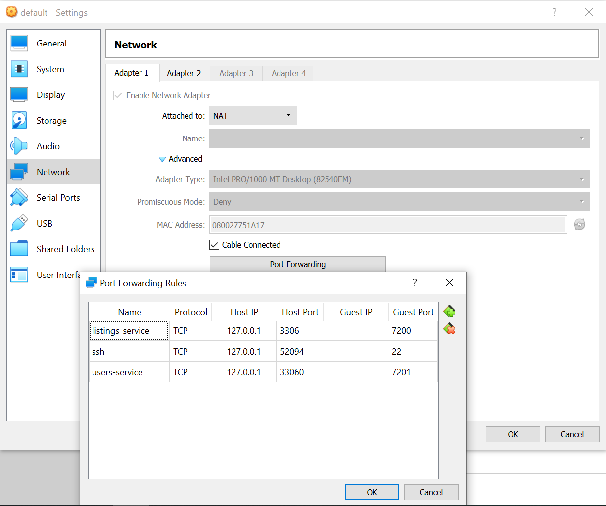

###### Photo by [Jen Theodore](https://medium.com/r/?url=https%3A%2F%2Funsplash.com%2F%40jentheodore%3Futm_source%3Dunsplash%26utm_medium%3Dreferral%26utm_content%3DcreditCopyText)
---

Recently I have been watching a tutorial where, in order to follow it, one should have [Docker](https://docs.docker.com/docker-for-windows/install/) running on his machine. _So far, so good, but it turned out that the latest versions of Docker require Windows 10 Pro, Enterprise or Education_. Which means that if you are like me and have just Windows 10 Home edition on your personal laptop, then you cannot use Docker…__or maybe you still can__. Read below to find out how 📑

## Reasoning
First, let's do a short resume on the situation. What do we want to achieve and what do we currently have?

We have Windows 10 OS Home edition on our machine and we would like to have Docker platform running on the same machine, so we are able to create docker images and run containers, so we can learn better and grow faster! The last one is a bit out of scope of this article, but one should start from somewhere, no? 😏.

## Actions
After defining what we want, let's see how to achieve it. Here are the steps I followed. It worked for me, which makes me share it with you, so maybe I would save someone a few days of going back and forth to StackOverflow! 😐

After some reading, I found this [article](http://support.divio.com/en/articles/646695-how-to-use-a-directory-outside-c-users-with-docker-toolbox-docker-for-windows), which explains that it is possible to use Docker in Windows 10 Home by leveraging a Linux virtual machine and have docker containers run on it.

1. First thing you need is, to install a software called [Oracle VM VirtualBox](https://www.virtualbox.org/). It gives you the ability to have multiple virtual machines installed on your physical one. This way we can have a virtual machine which will be running Linux where our Docker will live.
2. Then use Windows PowerShall and [Chocolatey](https://chocolatey.org/), your Windows package manager, to install a _docker-machine_ by running the following:

```bash
choco install docker-machine
```

3. Open your favorite bash terminal app and run this:
```bash
docker-machine create --driver virtualbox default
```

This will create a docker virtual machine called 'default'.

4. Next, we need to configure which ports are exposed when running Docker containers. You may do that by going to Oracle VM VirtualBox -> default virtual machine -> Settings -> Network -> Adapter 1 -> Port Forwarding



5. This was the __most critical to forget about__ detail for me - we need to allow Docker to mount volumes located on your hard drive. By default, you can only mount from the ```C://Users/``` directory. To add a different path, simply go to __Oracle VM VirtualBox__ GUI. Select __default__ VM and go to _Settings > Shared Folders_. If you don't mind to use the default settings, do not forget to put your project under 'Users' directory, e.g. ```C:\Users\{your project}```. In my case, I've forgotten about this and had to spend few days of head banging until I figured out why the hell was I getting "Couldn't find package.json" error when trying to run the [containers](https://github.com/mihailgaberov/microservices), built through this [tutorial](https://www.youtube.com/watch?v=6Yfm5gHQjaQ&list=PLnTRniWXnjf8YC9qJFLSVCrXfS6cyj6x6&index=2).

6. Start the virtual machine by running the following command in your terminal app:
```bash
docker-machine start default
```

7. Next, we need to set up Docker environment variables:
```bash
docker-machine env default
```

This is to allow the Docker client and Docker Compose to communicate with the Docker Engine running in the Linux VM, that we named "default".

You may also need to run:
```bash
@FOR /f "tokens=*" %i IN ('"C:\ProgramData\chocolatey\lib\docker-machine\bin\docker-machine.exe" env') DO @%i
```

, in order to get Docker working properly. _The specified path in the above command may vary depending on your setup_.

8. If you are going to use things, such as ```docker-compose up```, you will need to install Docker Tools as well. You may do it by running the following commands in PowerShall:
```bash
choco install docker-cli

choco install docker-compose
```

These will install everything you need to start using Docker on your Windows 10 Home OS.

## Conclusion

Now that we have all we need ready to use, we may spend our time on actual learning, either by following a docker related tutorial or a book. No matter what you want to do next, you have all the tools you will need. I personally will try to [finish](https://github.com/mihailgaberov/microservices) the previously mentioned tutorial and then, who knows, may be I will start using Docker for each next project I do.

By the way, during the process of searching described above, I found a very promising book which is specifically about Docker. It's called _"Docker in Practice" by Ian Miell_. If this interests you as well, you might want to take a look.

🔥 Thanks for reading! 🔥

### References
- https://www.virtualbox.org/
- https://www.sitepoint.com/docker-windows-10-home
- https://www.youtube.com/watch?v=6Yfm5gHQjaQ&list=PLnTRniWXnjf8YC9qJFLSVCrXfS6cyj6x6&index=2
- https://github.com/mihailgaberov/microservices
- http://support.divio.com/en/articles/646695-how-to-use-a-directory-outside-c-users-with-docker-toolbox-docker-for-windows
