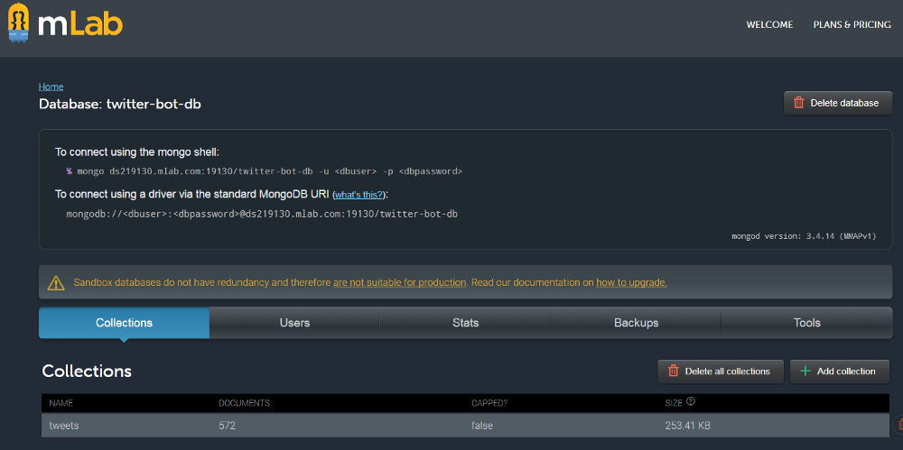

###### Photo by [Mihai Varga](https://unsplash.com/photos/RGwhPC5tLMQ?utm_source=unsplash&utm_medium=referral&utm_content=creditCopyText) on [Unsplash](https://unsplash.com/?utm_source=unsplash&utm_medium=referral&utm_content=creditCopyText)

In [another article](https://medium.com/@mihailgaberov/creating-a-twitter-bot-in-5am-2a42a9920e67) we saw how to create a twitter bot that sends private messages to his followers, containing tweets searched by predefined criteria — certain hashtags selected by us. This time we will improve the reports being sent, by adding additional functionality. We will store the results in a database and filter the newly received tweets according to what we have stored. Thus, we will be able to send only _(almost*)_ unique results.

__TL;DR__

This is the second part of a [step by step tutorial](https://medium.com/@mihailgaberov/creating-a-twitter-bot-in-5am-2a42a9920e67) showing you how to create your own Twitter bot and host it on [heroku](http://herokuapp.com/). This time we will upgrade our code by using [mongoose](https://www.npmjs.com/package/mongoose) and [MongoDB](https://www.mongodb.com/) to produce better results. Also, we will extend the usage of our _helpers_, by extracting there the composing of the messages content. In the end, we will see how can we use [Mlab](https://mlab.com/) hosting service (free plan) to host our database there.

If you want to skip right to the code, here is the [GitHub repo](https://github.com/mihailgaberov/twitter-bot/tree/v2).

__Reasoning__

What is the reason to do that?

>_Right now there are plenty of tutorials and articles about creating twitter bots out there, but I could not find any of them that extends the subject to the next level — offering direction for improving the way your bot handles the data._

That is why I decided to introduce a new player in the equation. Something that will help us to do more with our tweet reports — database.

__Database__

MongoDB is a famous [NoSQL](https://en.wikipedia.org/wiki/NoSQL) database that has great integration with [Node.js](https://nodejs.org/en/). It’s quick and easy to use, and it’s perfect for our purpose. We will use it to eliminate the duplicates from our feed, before sending the messages to the followers.

---

__Step by step__

If you want to follow through, here are the steps you may take:

1. Register a new account in [Mlab](https://mlab.com/signup/).
2. Add your DB_USER and DB_PASSWORD credentials to your .env file (same way as we did in the [first part](https://medium.com/@mihailgaberov/creating-a-twitter-bot-in-5am-2a42a9920e67) with the Twitter API keys).
3. Create a new directory called _“/db”_ in the root folder of your project and add a new file in it: __db.js__. Here is where we will put the logic for connecting with the database.
4. At the beginning of the file, import [mongoose](http://mongoosejs.com/) — a [MongoDB](https://www.mongodb.org/) object modeling tool, designed to work in an asynchronous environment. We will see a bit later how easy is to work with MongoDB when using __mongoose__ and __Node.js__.

```javascript
const mongoose = require('mongoose')
```

5. Next step is to compose our connection string. We need this, in order to be able to connect and consume our database. Here is how it should look like:

```javascript
const dbURI = `mongodb://${process.env.DB_USER}:${process.env.DB_PASS}
@ds219130.mlab.com:19130/twitter-bot-db`
```

6. The rest of this [file](https://github.com/mihailgaberov/twitter-bot/blob/v2/db/db.js) is just simple logic coming from _mongoose_, related to setting up different listeners for different events that might occur. One of these events is _“connected”_, this tells us when we are successfully connected to our database.

7. Setup your database model — in the same folder create a new file called __tweets.model.js__. Here is the logic behind our database model. A simple [mongoose schema](http://mongoosejs.com/docs/guide.html) that serves as a blueprint for our database documents. It contains only four fields. The unique ID parameter called _id_str_. We will use that when checking for duplicates. The content (_status_) of the tweet, the author name and the creation date of a tweet — _created_at_. All of the fields are defined as [string and required](http://mongoosejs.com/docs/schematypes.html).

```javascript
const tweetSchema = new Schema({ 
  id_str: { 
    type: String, 
    unique: true,
    required: true 
  }, 
  status: { 
    type: String, 
    required: true 
  }, 
  author: {
    type: String,
    required: true 
  }
  created_at: {
    type: String,
    required: true
})
```

8. The last step, for getting our database up and running, is to create our database controller. This file will contain the main logic for interacting with the database. Here we will put methods for reading and writing records from and into it. Also here, we will implement the functionality for getting only the unique tweets from each feed and record them for post usage. In order to start, create a new file in the _“/db”_ folder, name it __tweets.controller.js__ and paste [this code](https://github.com/mihailgaberov/twitter-bot/blob/v2/db/tweets.controller.js) in it. You probably have seen already, that in this file we have some of the methods exported and some of them defined as local constants. Following the best practices, we will be using only the exported ones in our main flow.

>_By defining the rest as local, we limit unnecessary exposure to the outer world._

Local methods, used only here:

```javascript
const fetchTweets = function () { ... }
const recordTweet = function ({ id_str, text, user }) {...}
```

Exported methods, used in [bot.js](https://github.com/mihailgaberov/twitter-bot/blob/v2/bot.js):

```javascript
module.exports.recordUniqueTweets = function (tweets) {...} 
module.exports.getUniqueTweets = function (latestTweets) {...}
```

__Helpers__

In my [previous article](https://medium.com/@mihailgaberov/creating-a-twitter-bot-in-5am-2a42a9920e67) I mentioned how good is to extract or modularize functionality that can be reused in many other places. We did that with a method for getting the current time. This time we will add another method to [helpers.js](https://github.com/mihailgaberov/twitter-bot/blob/v2/helpers.js), that we will be using for generating the messages content. If, for any reason, we don’t get any new tweets, we will send a message to the followers. Like this one:

```
`-— Nothing new this time (14.05.2018 14.02).`.
```

Also, we are going to refactor a little bit the method for getting the current time. And then we will be able to use it, when composing the messages content, to add the date of when a tweet is created.

```javascript
const from = this.getTime(tweet.created_at)
```

__Updating main flow__

After we finish with the database related tasks, it’s time to amend our [main application flow](https://github.com/mihailgaberov/twitter-bot/blob/v2/bot.js) and make it start using the new setup. Actually, the change we need to do is really minor. We need to import __db.js__ and __tweets.controller.js__ files from _“/db”_ folder like so:

```javascript
require('./db/db')
const db = require('./db/tweets.controller')
```

And then, in the callback of the first call that fetches the tweets, replace the _forEach_ loop with the following:

```javascript
 db.getUniqueTweets(data.statuses).then((tweets) => {        
     const content = helpers.composeContent(tweets)
     db.recordUniqueTweets(tweets)
  ...
})
```

That’s all. 👌

You can find the final version of the code [here](https://github.com/mihailgaberov/twitter-bot/blob/v2/bot.js).

__Hosting on Mlab__

OK, now we are done with the coding and it’s time to publish our updated application and the database it uses. To do so, we are going to use [Mlab](https://mlab.com/welcome/) for the database and, again, [Herokuapp](http://herokuapp.com/home) for the application itself.

If you need help for deploying the application with Heroku, you may take a look at the [first part](https://medium.com/@mihailgaberov/creating-a-twitter-bot-in-5am-2a42a9920e67) of this tutorial. Just don’t forget to add the new config variables to “Config Vars” section, under “Settings” tab.

In order to start using your database hosted on Mlab, you first need to login into your account and create a new database, using the control panel provided there.


Once created, just go to its settings and find the connection string that you need to add to your application.



>_If you have followed the coding part of this tutorial, you will have to add a collection into the database and name it ‘tweets’, in order to stay aligned with the code and get a working application in the end._

Once the database is properly created, the connection string is in place in your code and the application is deployed via Heroku, __you are good to go!__ 🎆 🆒


__Conclusion__

This article serves two purposes. One is to be like a logical continuation of the first [article](https://medium.com/@mihailgaberov/creating-a-twitter-bot-in-5am-2a42a9920e67). Second is to show how easily we can use noSQL database, like MongoDB, with Node.js, and services, like Mlab and Heroku, to achieve an improved version of a simple Twitter bot application. It might worth mentioning, that this way we actually are creating our own database with twitter statuses, that later might be used for something else. Maybe some statistical research or material for machine learning, who knows. __The best part of this is, that everything is happening automatically.__

>_There will be always options. We just need to think about them._

Note: _If you don’t want to use the user interface provided by Mlab, for interaction with the database, you can use other tools, such as [studio3t](https://studio3t.com/)._

Of course, any comments or questions are welcome.

🔥 Happy coding! 🔥

_You can find my implementation here https://github.com/mihailgaberov/twitter-bot. If you want to start receiving the same reports as me, follow my bot in Twitter @HerrKlinkerhof3._

---

_I am saying ‘almost’, because, in some cases, you might get tweets with the same content, but posted by different accounts. According to the implemented check these are different as they have different IDs, but still…_

Oh… and _thank you_ for reading. 😅

