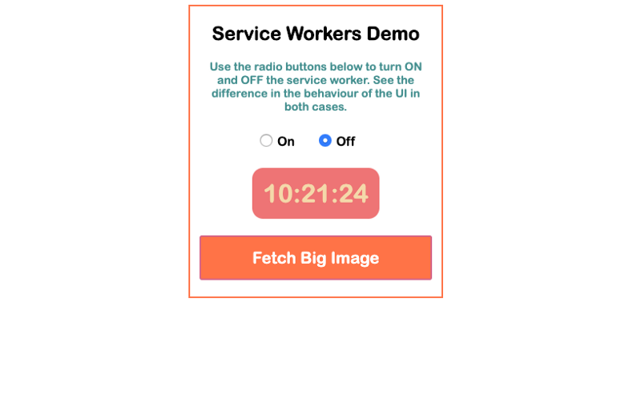

###### A nice image used for demonstration of SW work.
---
Every now and then we hear about optimizing something. There are different kinds of optimizations we could do to improve our apps . To make them faster and more efficient. To save time or memory. This article will cover one of those methods - _service workers._

## TL;DR
This tutorial explains what a service worker is and how to use it. In JavaScript. There is a code example in the end of it. If you want to skip the reading, [here](https://github.com/mihailgaberov/learn-service-workers) is the Git repo and [here](https://compassionate-brahmagupta-71d9b4.netlify.com/) you may see live demo.

## The Theory
Let's see first what a worker is this 👀 and what a service can we use it for 🤓.

The _service worker_ is a [simple script](https://developers.google.com/web/fundamentals/primers/service-workers/). JavaScript code, that your browser runs in the background, separate from a web page. It's very convenient to use service workers for features that don't need a web page or user interaction. One of the most common usage is intercepting and handling network requests. Which includes managing a cache of responses. The following is a simple example of how to include a service worker in your application run.
Usually in the entry point of your app, you put this:
```jsx
if ('serviceWorker' in navigator) {
  window.addEventListener('load', function() {
    navigator.serviceWorker.register('/service-worker.js');
  });
}
```

This way of using service workers is a little bit improved than the basic one. Which would be direct calling the _register()_ method inside the _if statement_. In this case, we use window load event to register the service worker after the page has finishes loading. After doing this, you need to add your service worker code in _service-worker.js_ file. At this point you might want to take a look at mine service worker file here.

_All major browsers support Service Workers now and you can start using them right away._

## The Example
Enough theory, let's build a real example app, that will leverage the service workers feature.
Let's imagine we are building an app that needs to load a big chunk of data. It could be, for example, a nice, big full screen image, we would display on the front page. Or it could be big video clip we have to wait to load. This is ideal use case for a service worker to shine. Let's see how. 👀

In our specific case we will use the clock time to show the benefit of using service workers. What I mean is, that we will build a simple app, showing the time. It will have a nice, big button for fetching a nice, big image. And it will provide the user with an option to choose __to use or not__ a service worker.

Here is a screenshot of how it looks like.



What this app demonstrates is, that when fetching the image (by clicking the button, wow!) with an active service worker - we don't get blocked UI (user interface, i.e. fields, buttons, 🐛). If you choose not to use the service worker, you will get a frozen UI for certain period of time. When the work completes and the main thread frees itself, it will unfreeze the UI.

If you don't want to clone and run the code yourself, jump straight to the [live demo](https://compassionate-brahmagupta-71d9b4.netlify.com/).

## Conclusion
This demo of service workers in action shows us the advantage we get from using them. Especially when you are trying to build responsive and robust JavaScript applications. No user wants to end up in a frozen page for unknown time, as no developer should want that for his application's users. Keeping in mind the above, service workers are a *must* now. And we should not neglect them.

🔥 Thanks for reading! 🔥
