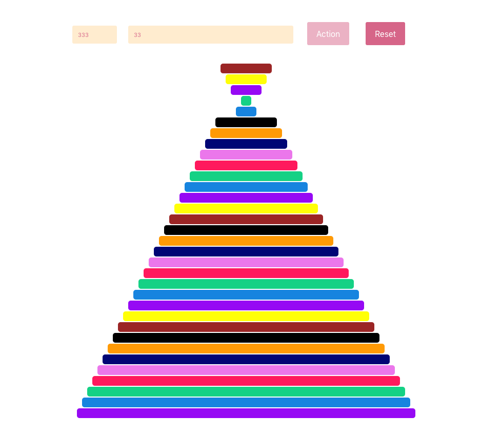

What you are going to see below was suppose to be part of my solution to an exercise given in a coding challenge. It was several months ago and I had signed in for it. Due to unforeseen factors, I haven't gone to the end. Now, after that time and the challenge finished, I can share it here.

This is not going to be a step-by-step tutorial. Rather a quick review of how can we use frameworks like React and Popmotion.io, and an algorithm. And create a nice visualization of that very same algorithm. Somehow it feels nice! 🤓

The so called [Pancakes Sorting Algorithm](https://en.wikipedia.org/wiki/Pancake_sorting) is famous (or not?) sorting algorithm, that you can read a lot in internet, if interested. Its nature is out of the scope of this article. Here we only see it in action with nice animations, thanks to Popmotion.io.

Here is the [live demo](https://pancakes-algorithm.herokuapp.com/) you can play with. And [here](https://gitlab.com/mihailgaberov/pancake-algorithm-visualizer) is where you can find the source code of it. Feel free to check it out and take a closer look. You might try to amend the animations I did. I would be more than interested to see your versions :)

That was all. Nice and short, perfect for the summer! ☀️ 🏖

🔥 Thanks for reading! 🔥
