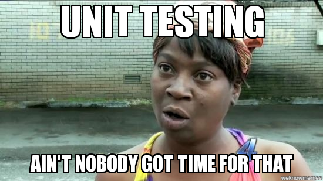

###### Photo by [Artem Sapegin](https://unsplash.com/photos/ZMraoOybTLQ?utm_source=unsplash&utm_medium=referral&utm_content=creditCopyText) on [Unsplash](https://unsplash.com/search/photos/unit-testing-reactjs?utm_source=unsplash&utm_medium=referral&utm_content=creditCopyText)

There are a lot of discussions in the web when we talk about testing. And even more about unit testing. In [React](https://reactjs.org/).

__TL;DR__

This is going to be a brief summary of what and how should we think about when we test a [ReactJS](https://github.com/facebook/react/) application. More specific, what should we write tests for, when creating React components for our app. If you want to skip the reading, [here](http://mihailgaberov.github.io/testing-reactjs-presentation/) you can find shorter version in a few slides.

>_All of the points below are recommended by people smarter than me. I just collected them as a summary of best practices, trying to help my team to decide on the matter. And start using them in our day-to-day work._

__Do we need unit tests?__

This is a long time discussion, that has only one right answer. Yes! Tests provide developers with confidence. This confidence allows us to produce software with better quality. To do proper refactoring. And to reason better about what we do.

In short term it might look it’s not worth it. That it takes too much time. Time we might spend for implementing features instead. But very soon after the start of every project, the payoff of having a nice test suit is huge. The punishment of not having such, especially when a release date is approaching — disaster!

__Test render logic__

When we write tests for our components, we write them in such way that they test only the render logic and don’t care about any internal implementation. What does this mean? It means that, your test should be testing the things that the user will be seeing and interacting with. Let’s say you are testing a component that displays a button on the screen.

>_When the user clicks the button, your component renders a message in a div element. Your test should check practically for the same — check if the button is clickable and if this div exists after the clicking._

__No lifecycle methods__

Tests should not test lifecycle methods, they are supposed to be covered by React itself. If we have some logic that needs to be tested in these methods, we should try to extract it in another testable place and only use it in there. Ideally, in our _componentDidMount_ method for example, we should have only functionality for fetching data (calling an API for example). All the rest that you might be tempted to leave there, should be extracted in other methods, that could be tested, if needed.

No outsiders

>_(Unit) Tests should not test interaction with outside world!_

The name “unit” implies independence and autonomy. A unit test should be an encapsulated piece of code, that has inside everything it needs to perform its job. When we need to write tests which need data, we use mocks. That said, every interaction with APIs, DBs, etc., is not a matter of unit tests and should not be tested in such.

__Small, smaller, easier__

Tests should be small and easy to read — if we need to test a big component with a lot of dependencies, we need to consider splitting it to smaller testable pieces.

>_Dīvide et imperā._

As the famous quote above implies, it’s a lot more easier to deal with small, well modularized components, than the opposite. Also, if we need to use big mocks, we need to extract them out of the test and only use them by importing, in order to avoid polluting the test file.

---

__Example__

 - Given a simple component containing a button and a text field
 - We should test what the user sees — rendering, and what the user can do — user interaction
 - If there is visual change after clicking — test for it
 - If there is a value returned after clicking — test for it

_But we don’t care about the internal implementation of the click handler!_

I have prepared a small example, trying to demonstrate the above. You can find it [here](https://github.com/mihailgaberov/testing-reactjs-examples). In order to run it locally on your machines, just clone it and install the dependencies. Then do _‘npm run test’_. 🚀 📜

__References__

There are many resources on that subject online, but I am going to list here the ones I have found very useful and learned from them.

👏 A [nice article](https://medium.freecodecamp.org/the-right-way-to-test-react-components-548a4736ab22) on the subject

👏 [Another good one](https://www.leighhalliday.com/testing-react-jest-enzyme-sinon) for testing with Jest, Enzyme and Sinon

👏 [Jest Cheat sheet](https://github.com/sapegin/jest-cheat-sheet)

👏 [Presentation slides](https://mihailgaberov.github.io/testing-reactjs-presentation) online

👏 [Github repo](https://github.com/mihailgaberov/testing-reactjs-examples) with working examples

__Conclusion__

The important lesson we must keep from all this testing stuff is, that no matter how exactly we write our tests (well it matters…a bit 💬), as long as we write tests at all. This way of thinking and working should become our second nature when we are striving to produce errorproof software. With time and practice the things become better and easier. The most important thing for us is to never stop improving.

>_Keep going!_

🔥 Thanks for reading! 🔥
